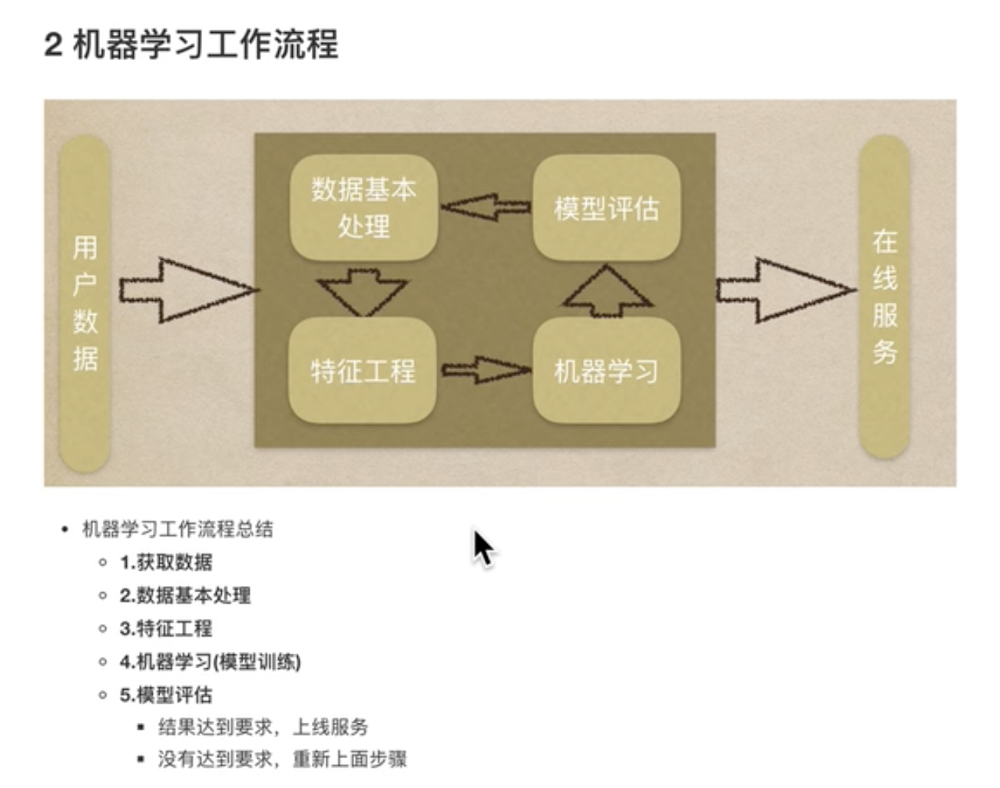
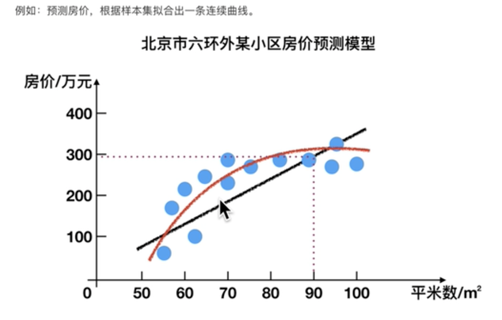
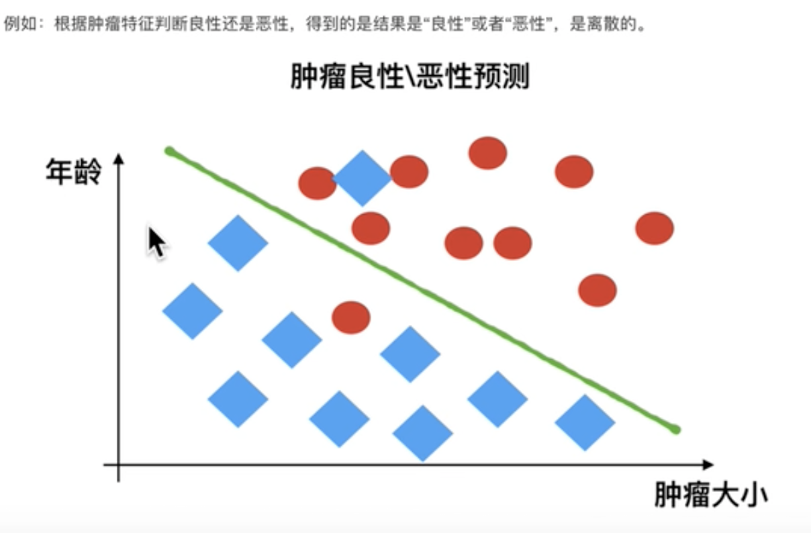
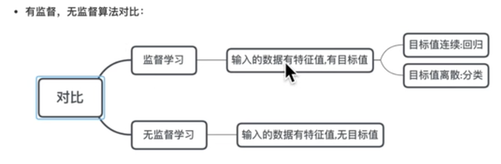
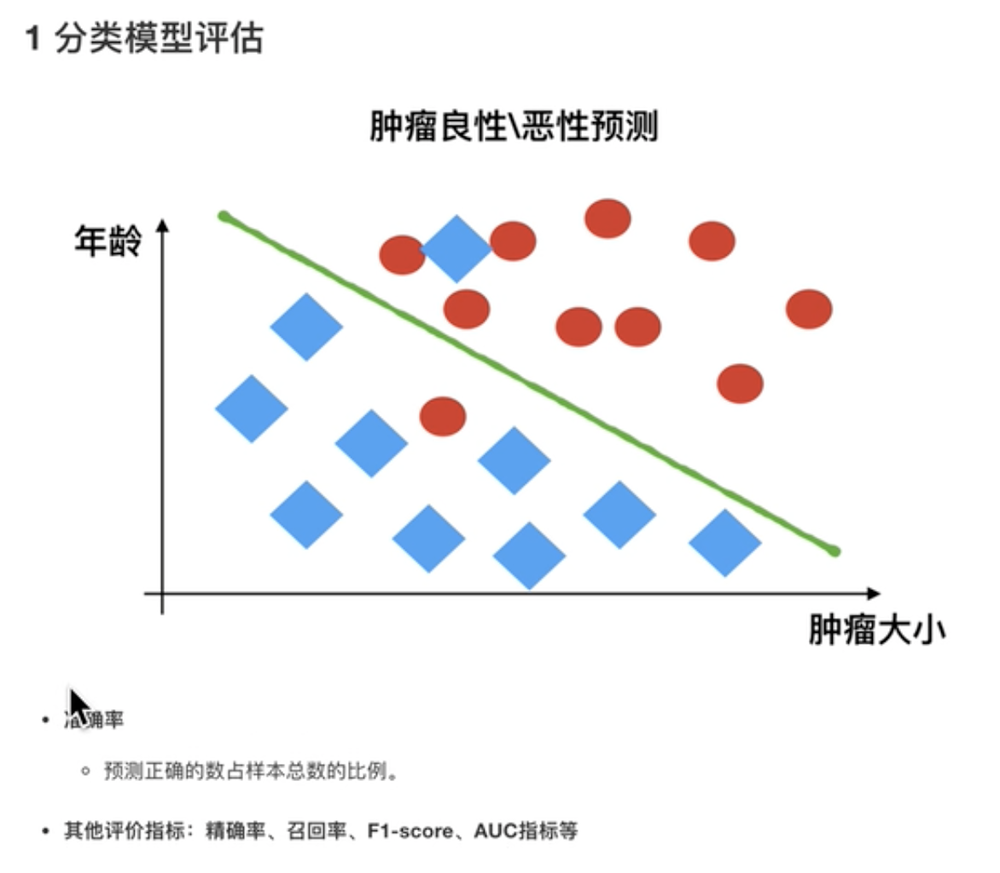
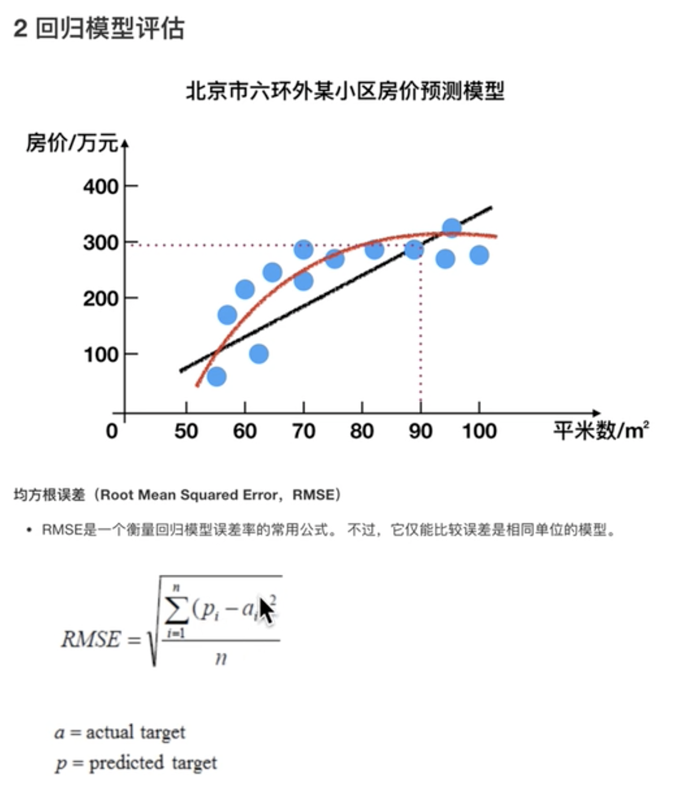

# 机器学习
## 什么是机器学习
从数据中自动获得模型，并利用模型对未知数据进行预测

## 机器学习工作流程

### 获取到的数据集
- 数据类型构成
  - 数据类型一：特征值+目标值
  - 数据类型二：只有特征值
- 数据分割
  - 机器学习一般将数据集合划分为两个部分
    - 训练数据：用于训练，构建模型
    - 测试数据：在模型检验时使用，用于评估模型是否有效
  - 划分比例
    - 训练集：70 80 75
    - 测试集：30 20 25
  
### 数据基本处理
对数据进行缺失值、异常值等处理

### 特征工程
使用专业背景知识和技巧处理数据，使得特征能在机器学习算法上发挥更好的作用的过程

包含：
- 特征提取
- 特征预处理
- 特征降维

## 机器学习算法分类
### 监督学习
定义：输入数据是由输入特征值和目标值所组成
- 函数的输出可以是一个连续的值（称为回归）
- 或是输出有限个离散值（称为分类）

#### 回归问题

回归模型-线性回归

#### 分类问题

分类模型-kNN-决策树-逻辑斯蒂回归

### 无监督学习
定义：输入数据是由输入特征值组成，没有目标值
- 输入数据没有被标记，也没有确定的结果，样本数据类别未知
- 需要根据样本间的相似性对样本集进行类别划分

类聚  k-means
降维

对比

### 半监督学习
训练集同时包含有标记样本数据和无标记样本数据

### 强化学习

## 模型评估
### 分类模型评估

### 回归模型评估
均方根误差

### 拟合
- 欠拟合：模型学习的太过粗糙，连训练集中的样本数据特征关系都没学出来
  - 例如模型学习到白色有翅膀的就是天鹅，这显然不对
- 过拟合：所建的模型在训练样本中表现的过于优越，导致在测试集中表现不佳
