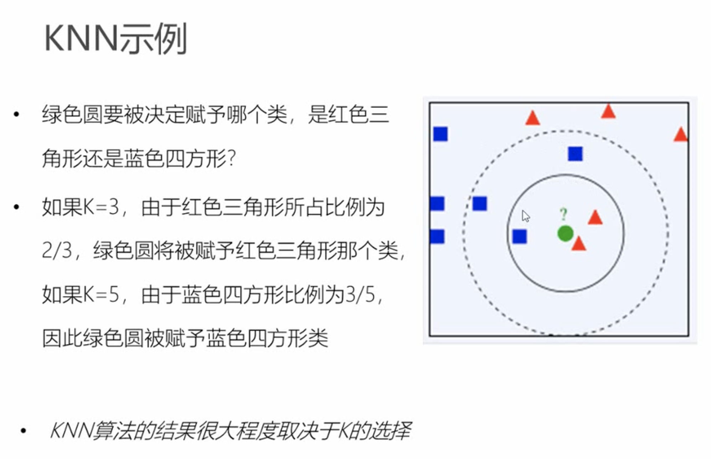
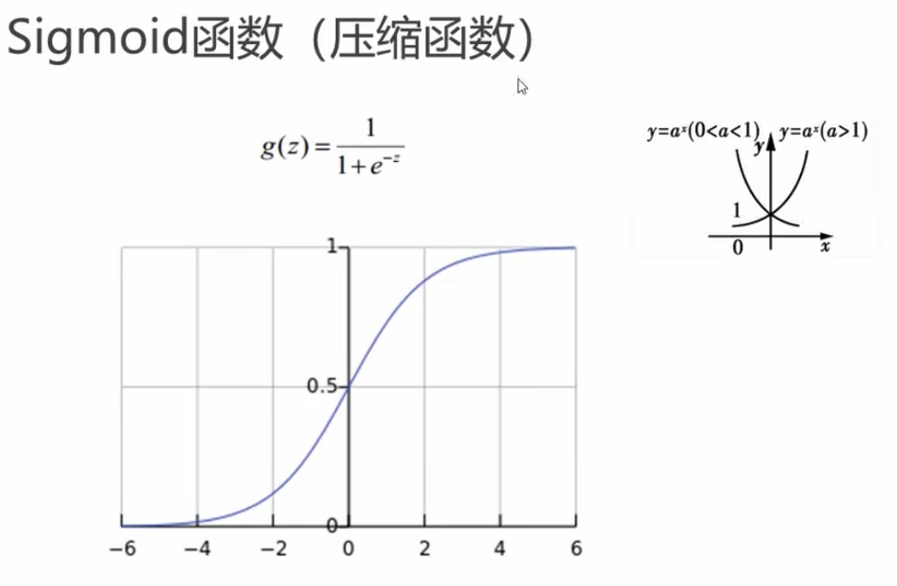
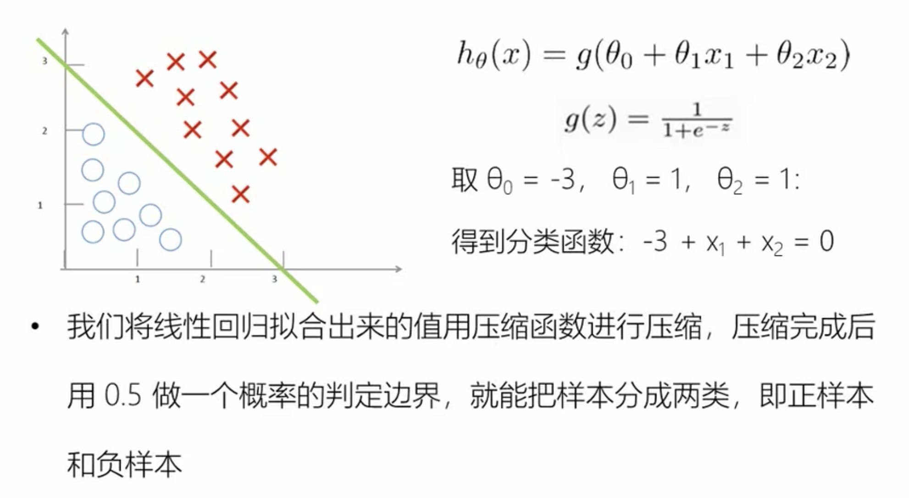
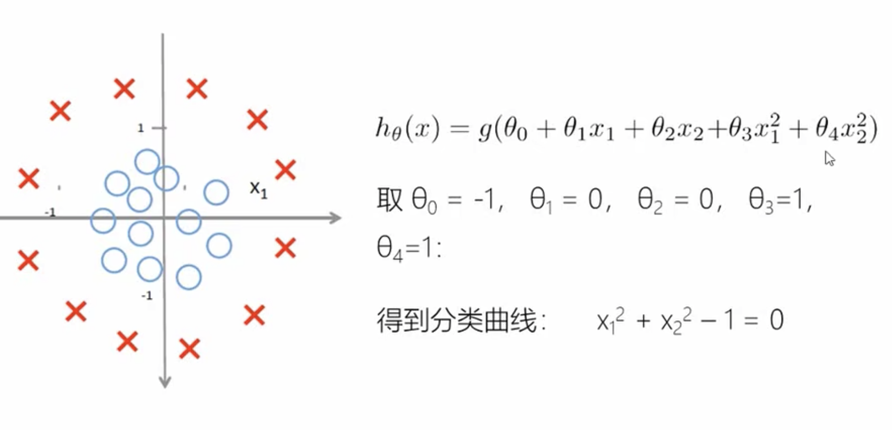
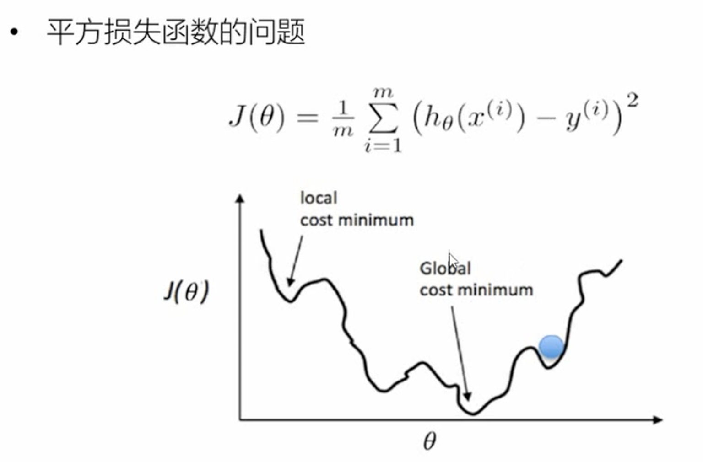
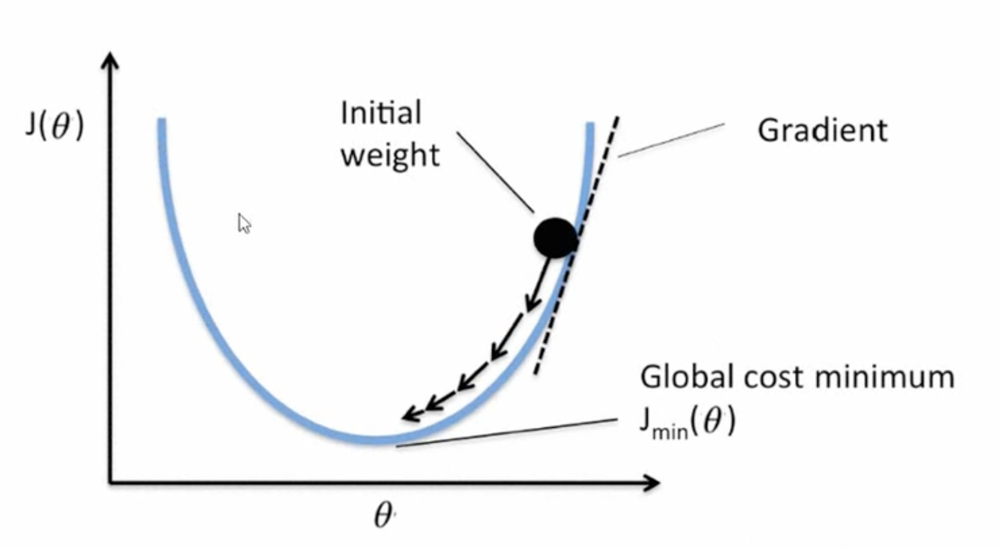
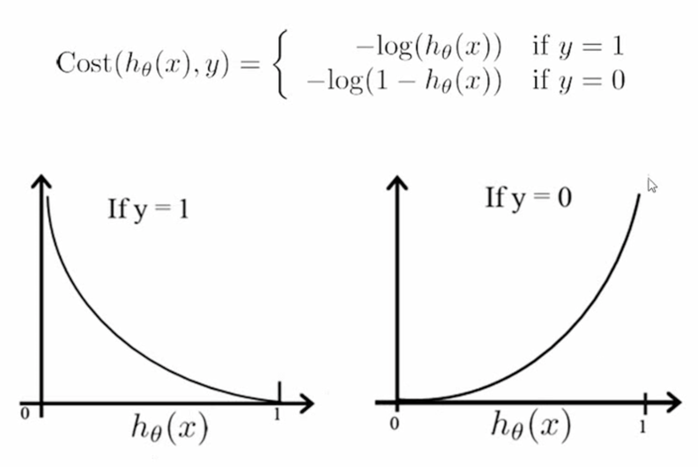

# 分类模型
## k近邻
K最近邻算法（K-Nearest Neighbors，简称KNN）是一种常见的分类算法，它的基本思想是根据样本之间的距离进行分类。KNN算法的本质是通过计算待分类样本与训练集中所有样本的距离，然后选取与待分类样本距离最近的K个训练样本。然后，根据这K个样本的类别进行投票，将待分类样本归为票数最多的类别。

KNN算法的步骤如下：

1. 计算待分类样本与所有训练集样本之间的距离
2. 选取与待分类样本距离最近的K个训练样本
3. 统计这K个样本中各类别出现的次数
4. 将待分类样本归入出现次数最多的类别中

在KNN算法中，K的取值是一个超参数，需要通过交叉验证等方式进行调参。较小的K值会使分类结果对噪声敏感，较大的K值会使分类结果对样本数量的影响变小，但可能会将不同类别的样本归为同一类别。

KNN算法有以下优点：

1. 简单易懂，容易实现
2. 适用于多分类问题和非线性分类问题
3. 对异常数据不敏感

但也存在以下缺点：

1. 计算量大，对于大规模数据集计算时间较长
2. 需要大量存储训练数据，空间复杂度高
3. 对于高维数据，KNN算法的效果可能不好
4. 对于不平衡的数据集，KNN算法的效果可能不好

KNN算法在实际应用中被广泛地应用，例如图像分类、推荐系统、医学诊断等领域。

### kNN距离计算
在KNN算法中，需要计算待分类样本与所有训练样本之间的距离，以便选取与待分类样本距离最近的K个训练样本。常用的距离计算方法包括以下几种：

1. 欧式距离（Euclidean Distance）

欧式距离是最常用的距离计算方法，它是指两个样本点在坐标系中的欧式距离，即：

$$
dist(x, y) = \sqrt{\sum_{i=1}^n (x_i - y_i)^2}
$$

其中，$x$和$y$是两个样本点，$n$是样本的特征维数。

欧氏距离是最常用的距离计算方法之一，在KNN算法等机器学习算法中经常被使用。下面是欧氏距离的推导过程：

假设有两个点 $x = (x_1, x_2, ..., x_n)$ 和 $y = (y_1, y_2, ..., y_n)$，它们在 $n$ 维空间中的坐标分别为 $x$ 和 $y$。则这两个点之间的欧氏距离为：

$$
d(x, y) = \sqrt{(x_1 - y_1)^2 + (x_2 - y_2)^2 + ... + (x_n - y_n)^2}
$$

我们可以将上式展开，得到：

$$
\begin{aligned}
d(x, y)^2 &= (x_1 - y_1)^2 + (x_2 - y_2)^2 + ... + (x_n - y_n)^2 \\
&= x_1^2 - 2x_1y_1 + y_1^2 + x_2^2 - 2x_2y_2 + y_2^2 + ... + x_n^2 - 2x_ny_n + y_n^2 \\
&= \sum_{i=1}^n (x_i^2 + y_i^2 - 2x_iy_i)
\end{aligned}
$$

因此，欧氏距离可以用点积的形式表示：

$$
d(x, y) = \sqrt{\sum_{i=1}^n (x_i - y_i)^2} = \sqrt{\sum_{i=1}^n x_i^2 + \sum_{i=1}^n y_i^2 - 2\sum_{i=1}^n x_iy_i} = \sqrt{x \cdot x + y \cdot y - 2x \cdot y}
$$

其中，点积 $x \cdot y$ 表示向量 $x$ 和 $y$ 在 $n$ 维空间中的内积，即：

$$
x \cdot y = \sum_{i=1}^n x_i y_i
$$

因此，欧氏距离的计算可以转化为向量之间点积的计算。

2. 曼哈顿距离（Manhattan Distance）

曼哈顿距离是另一种常用的距离计算方法，它是指两个样本点在坐标系中的曼哈顿距离，即：

$$
dist(x, y) = \sum_{i=1}^n |x_i - y_i|
$$

曼哈顿距离计算的思想是，计算两个点在坐标系中沿着坐标轴方向的距离之和。

3. 余弦相似度（Cosine Similarity）

余弦相似度是一种用于计算两个向量之间相似度的方法，它是指两个向量之间的夹角余弦值，即：

$$
similarity(x, y) = \frac{x \cdot y}{||x||_2 ||y||_2}
$$

其中，$x$和$y$是两个向量，$||\cdot||_2$表示向量的2-范数，$x \cdot y$表示向量$x$和$y$的点积。余弦相似度计算的思想是，计算两个向量在高维空间中的夹角余弦值，值越接近1表示相似度越高，值越接近0表示相似度越低。

除了上述常用的距离计算方法，还有其他一些距离计算方法，如切比雪夫距离、马氏距离等。在实际应用中，需要根据具体的问题选择合适的距离计算方法。

## 逻辑斯蒂回归
逻辑斯蒂回归（Logistic Regression）模型是一种广泛应用于分类问题的模型，其基本思想是将输入特征与一个逻辑斯蒂函数（Logistic Function）结合，得到输出类别的概率。其公式推导过程如下：

假设有 $m$ 个样本，每个样本有 $n$ 个特征，其中第 $i$ 个样本的输入特征为 $\boldsymbol{x}^{(i)} = [x_1^{(i)}, x_2^{(i)}, ..., x_n^{(i)}]^T$，输出类别为 $y^{(i)} \in \{0, 1\}$。我们的目标是学习一个函数 $h(\boldsymbol{x})$，用于预测新样本的输出类别。

为了得到概率预测，我们可以采用逻辑斯蒂函数将输入特征映射到 (0, 1) 区间内，逻辑斯蒂函数的公式为：

$$
g(z)=\frac{1}{1+e^{-z}}
$$

其中，$z$ 为任意实数。逻辑斯蒂函数将实数 $z$ 映射到 0 和 1 之间，因此可以用来表示输出为正类别的概率。在逻辑斯蒂回归中，我们将线性回归模型的预测值 $\boldsymbol{w}^T \boldsymbol{x} + b$ 作为逻辑斯蒂函数的输入 $z$，即：

$$
h(\boldsymbol{x})=g(\boldsymbol{w}^T \boldsymbol{x} + b)=\frac{1}{1+e^{-(\boldsymbol{w}^T \boldsymbol{x} + b)}}
$$

其中，$\boldsymbol{w} = [w_1, w_2, ..., w_n]^T$ 是模型的权重参数，$b$ 是偏置参数，需要通过训练来确定。

为了训练模型，我们需要定义损失函数，通常使用对数似然损失函数，其公式为：

$$
J(\boldsymbol{w}, b) = -\frac{1}{m} \sum_{i=1}^m [y^{(i)} \log h(\boldsymbol{x}^{(i)}) + (1 - y^{(i)}) \log(1 - h(\boldsymbol{x}^{(i)}))]
$$

其中，$h(\boldsymbol{x}^{(i)})$ 是模型对第 $i$ 个样本的预测输出概率，$y^{(i)}$ 是第 $i$ 个样本的真实类别标记。

我们的目标是最小化损失函数 $J(\boldsymbol{w}, b)$，可以使用梯度下降等优化算法来求解最优参数 $\boldsymbol{w}$ 和 $b$。求解过程中需要对损失函数求偏导数，得到梯度：

$$
\frac{\partial J(\boldsymbol{w}, b)}{\partial \boldsymbol{w}} = \frac{1}{m} \sum_{i=1}^m (h(\boldsymbol{x}^{(i)}) - y^{(i)}) \boldsymbol{x}^{(i)}
$$

$$
\frac{\partial J(\boldsymbol{w}, b)}{\partial b} = \frac{1}{m} \sum_{i=1}^m (h(\boldsymbol{x}^{(i)}) - y^{(i)})
$$

然后使用梯度下降算法迭代更新参数，直到达到收敛条件。
/
逻辑斯蒂回归（Logistic Regression）是一种常用的分类算法，主要用于解决二分类问题，也可以扩展到多分类问题。逻辑斯蒂回归的基本思想是利用特征对样本进行分类，并给出概率预测。逻辑斯蒂回归的模型假设数据服从逻辑斯蒂分布，然后通过最大化似然函数或最小化损失函数来估计模型参数。

逻辑斯蒂回归的模型形式如下：

$$ P(y=1|x) = \frac{1}{1 + e^{-z}} $$

其中 $z = \theta_0 + \theta_1 x_1 + ... + \theta_n x_n$ 是模型对样本的线性预测，$\theta_0, \theta_1, ..., \theta_n$ 是模型的参数，$x_1, ..., x_n$ 是样本的特征，$y$ 是样本的标签，取值为 $0$ 或 $1$。$P(y=1|x)$ 表示模型预测样本的标签为 $1$ 的概率，$1-P(y=1|x)$ 则表示预测标签为 $0$ 的概率。

### 损失函数
#### 平房损失函数的问题
平方损失函数的定义如下：

$$ L(y, \hat{y}) = \frac{1}{n} \sum_{i=1}^{n} (y_i - \hat{y_i})^2 $$

其中，$y$ 是真实值，$\hat{y}$ 是模型的预测值，$n$ 是样本数。平方损失函数的意义是，对于每个样本，计算它的预测值与真实值之差的平方，然后再求所有样本的平均值。因此，平方损失函数越小，表示模型的预测结果与真实值之间的差距越小，模型的性能越好。

之前的回归问题能够使用平方损失，是应为他们的损失函数对于$\theta$是二次函数，能够通过梯度下降很容易找到最优值，但逻辑斯蒂回归使用平方损失函数则不是二次函数，很容易陷入局部最优的情况。另外逻辑斯蒂回归的预测值是概率结果，所归属的分类只有$[0,1]$，当预测值处于一个中间值时，两种结果的误差对比不大。

我们希望的损失函数是这样的：

#### 最大似然估计或者最小化交叉熵损失函数
逻辑斯蒂回归的训练过程通常采用最大似然估计或者最小化交叉熵损失函数。在训练过程中，通过梯度下降等优化算法来更新模型参数，使模型对样本的分类效果最优。

逻辑斯蒂回归的损失函数通常采用交叉熵损失函数（Cross-Entropy Loss），用于衡量模型预测结果与真实标签之间的差距。在二分类问题中，交叉熵损失函数的形式如下：

$$ L(y, \hat{y}) = -[y\log(\hat{y}) + (1-y)\log(1-\hat{y})] $$

其中 $y$ 是真实标签，取值为 $0$ 或 $1$；$\hat{y}$ 是模型的预测值，取值范围为 $[0, 1]$。当 $y=1$ 时，损失函数的值为 $\log(\hat{y})$，用于衡量正样本的预测误差；当 $y=0$ 时，损失函数的值为 $\log(1-\hat{y})$，用于衡量负样本的预测误差。

可以看到，当 $y=1$ 时，如果 $\hat{y}$ 越接近 $1$，损失函数越小，否则损失函数会越大；当 $y=0$ 时，如果 $\hat{y}$ 越接近 $0$，损失函数越小，否则损失函数会越大。因此，交叉熵损失函数的作用是最小化模型的预测误差，使得模型的预测结果尽可能接近真实标签。

得到平均损失函数：$$ L(y, \hat{y}) = -\frac{1}{n} \sum_{i=1}^{n} [y_i\log(\hat{y}_i) + (1-y_i)\log(1-\hat{y}_i)] $$

其中，$y_i$ 是第 $i$ 个样本的真实标签，$\hat{y}_i$ 是第 $i$ 个样本的预测值。

为了防止过拟合，加入正则化项：
在逻辑斯蒂回归的损失函数 $L(y, \hat{y}) = -[y\log(\hat{y}) + (1-y)\log(1-\hat{y})]$ 上加上正则化项，可以得到带有正则化的逻辑斯蒂回归损失函数：

$$ L_{reg}(y, \hat{y}) = -\frac{1}{n} \sum_{i=1}^{n} [y_i\log(\hat{y}_i) + (1-y_i)\log(1-\hat{y}_i)] + \lambda\Omega(\theta) $$

其中，$\lambda$ 是正则化系数，$\Omega(\theta)$ 是正则化项，$\theta$ 是模型参数。常见的正则化项有L1正则化和L2正则化。

L1正则化项如下：

$$ \Omega(\theta) = \sum_{j=1}^{m} |\theta_j| $$

L2正则化项如下：

$$ \Omega(\theta) = \sum_{j=1}^{m} \theta_j^2 $$

在实际中，逻辑斯蒂回归常常使用随机梯度下降（Stochastic Gradient Descent，SGD）等优化算法来最小化交叉熵损失函数。通过迭代更新模型参数，使得模型的预测结果逐步接近真实标签，从而得到最优的模型参数。

## 决策树
决策树（Decision Tree）是一种基于树形结构的分类与回归模型，它通过对数据集进行划分，逐步构建一棵树，直到每个叶子节点都对应一个类别或回归值。决策树的每个内部节点表示一个特征，每个叶子节点表示一个类别或回归值，从根节点到叶子节点的路径表示一个实例的分类或回归过程。

在构建决策树时，通常采用贪心策略，从根节点开始，每次选择一个最优的特征进行划分，直到满足某些停止条件，如节点样本数量达到一定阈值、树的深度达到一定限制、信息增益或基尼不纯度低于一定阈值等。常见的决策树算法有ID3、C4.5、CART等。

决策树的优点包括：

1. 简单直观，易于理解和解释。

2. 能够处理连续特征和离散特征，不需要对数据进行过多的预处理。

3. 能够处理多分类问题和回归问题，具有很好的泛化性能。

4. 可以通过剪枝等方法来避免过拟合。

决策树的缺点包括：

1. 容易受到噪声数据和异常值的影响，容易过拟合。

2. 对于某些复杂的关系，决策树很难进行捕捉。

3. 在处理高维数据时，决策树的表现可能不如其他模型。

4. 对于不平衡数据，决策树可能会产生偏差。

需要根据具体的应用场景和数据特点来选择合适的决策树算法，并进行参数调整和模型优化，以达到更好的性能。