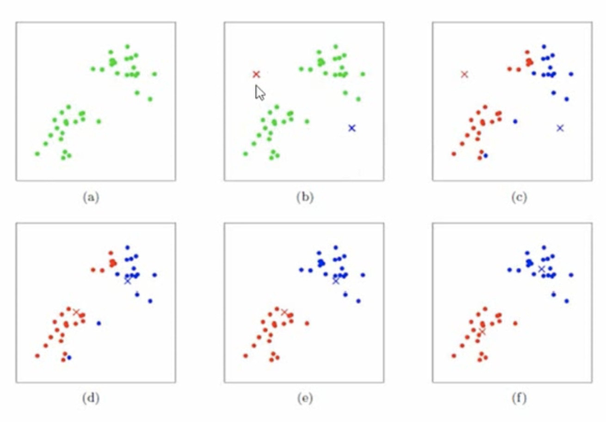

# 无监督学习
- 聚类
  - k均值
  - 基于密度的聚类
  - 最大期望聚类
- 降维
  - 潜语义分析（LSA）
  - 主成分分析（PCA）
  - 奇异值分解（SVD）

## 聚类
### k均值
k均值（k-means）是一种常用的聚类算法，它将数据集分成k个簇，每个簇的中心点就是该簇所有样本的均值。k均值算法的基本思想是：先随机选择k个中心点，然后将每个样本点分配到与其最近的中心点所在的簇中，接着重新计算每个簇的中心点，直到簇的中心点不再发生变化或达到预设的迭代次数为止。k均值算法通常采用欧氏距离作为相似度度量，同时也支持其他的距离度量方法。

k均值算法的优点包括：

1. 算法简单，易于实现。

2. 可以处理大规模数据集。

3. 聚类效果较好，能够快速收敛。

k均值算法的缺点包括：

1. 需要预先指定簇的个数k。

2. 对于不同形状、尺寸、密度的簇，聚类效果可能较差。

3. 对于噪声数据和离群点较为敏感。

4. 需要多次运行算法才能得到较好的结果。

需要注意的是，k均值算法的聚类效果受到初始中心点的影响较大。因此，通常需要多次运行算法，并选择聚类效果最好的结果。同时，为了避免算法陷入局部最优解，也可以采用一些启发式的方法来选择初始中心点，例如k-means++zhu

核心思想：由用户指定k各初始质心，以作为聚类的类别，重复迭代直至算法收敛

k均值聚类算法的基本流程如下：
1. 选择簇的个数k。
2. 随机初始化k个中心点，可以从数据集中随机选择k个样本点作为中心点，或者采用其他启发式方法来选择中心点。
3. 对于每个数据点，计算它与k个中心点的距离，并将它归到距离最近的中心点所在的簇中。
4. 对于每个簇，重新计算该簇的中心点，即将该簇内所有数据点的坐标取平均值。
5. 重复执行步骤3和步骤4，直到簇的中心点不再发生变化或达到预设的迭代次数为止。
6. 输出聚类结果，即每个数据点所属的簇。

