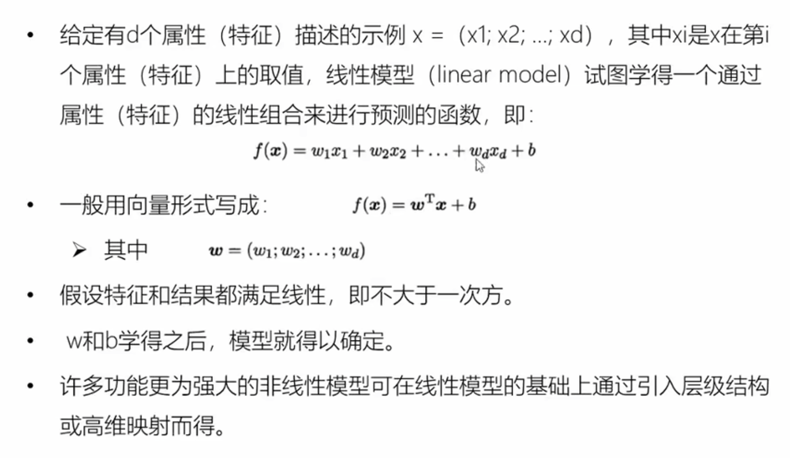
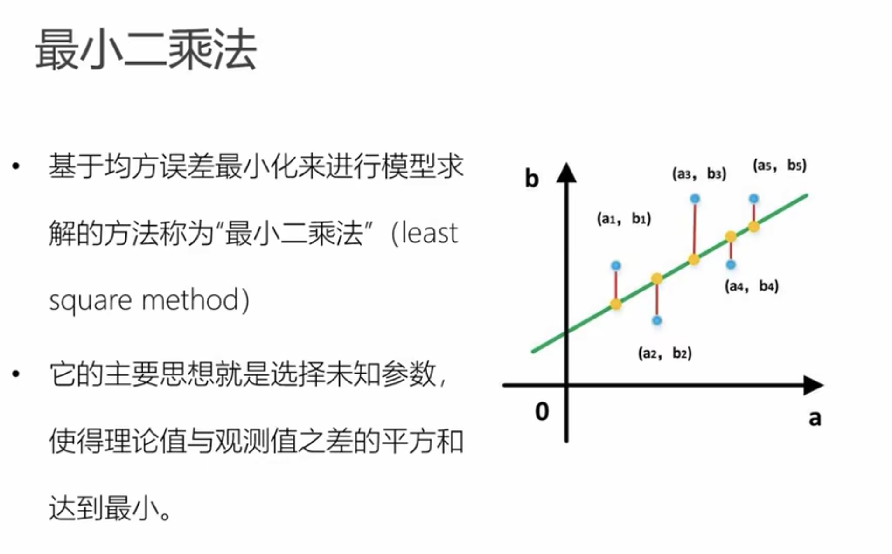
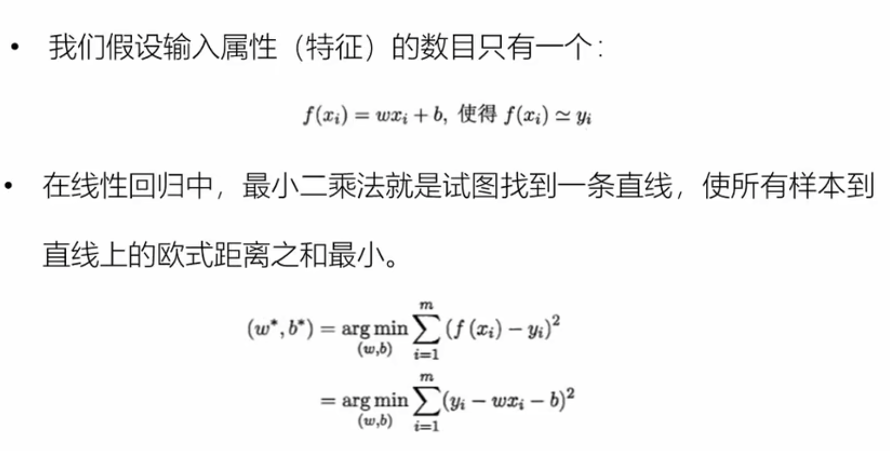
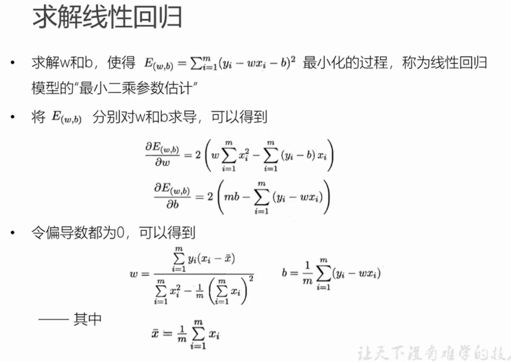
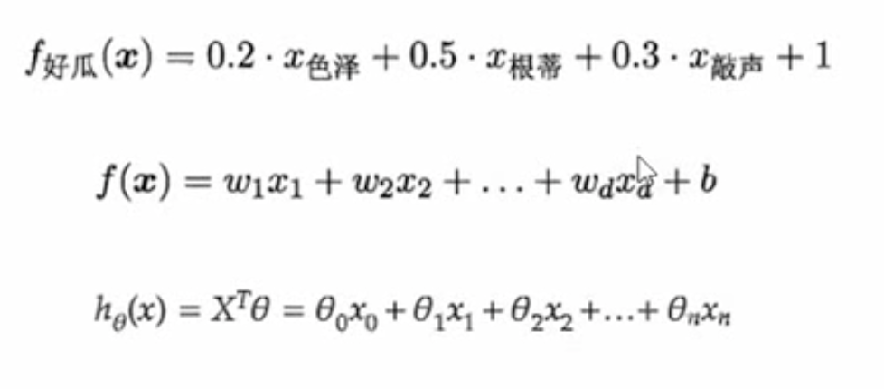
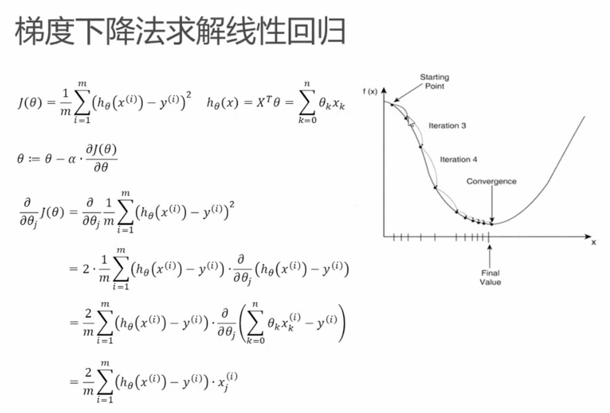

# 线性回归模型
- 线性回归是一种线性模型，他假设输入变量x和单个输出变量y之间存在线性关系

## 最小二乘法

## 多元线性回归
如果有两个或以上的自变量，这样的线性回归分析就称为多元线性回归

## 梯度下降法求解线性回归

### 为什么是梯度下降
在优化问题中，我们希望找到一个函数的最小值，例如最小化代价函数或误差函数。梯度是一个向量，它指向函数增加最快的方向，它的反方向指向函数减少最快的方向。因此，我们希望在每一步优化中，能够朝着梯度的反方向前进，以期望到达函数的最小值点。

梯度下降算法就是一种根据梯度反方向调整参数的优化算法。在每一步迭代中，梯度下降算法计算当前位置的梯度，并选择沿着梯度反方向的步长，以期望到达函数的最小值。因此，迭代的方向就是梯度的反方向。

具体地，设代价函数为 $J(\theta)$，其中 $\theta$ 是需要优化的参数向量。梯度 $\nabla_{\theta} J(\theta)$ 指向代价函数增加最快的方向，因此梯度的反方向 $-\nabla_{\theta} J(\theta)$ 指向代价函数减少最快的方向。梯度下降算法的迭代公式为：

$$
\theta_{i+1} = \theta_i - \alpha \nabla_{\theta} J(\theta_i)
$$

其中 $\alpha$ 是学习率，控制每一步迭代的步长。在每一步迭代中，我们根据当前位置 $\theta_i$ 计算梯度 $\nabla_{\theta} J(\theta_i)$，然后选择沿着梯度反方向的步长 $\alpha \nabla_{\theta} J(\theta_i)$，更新参数向量 $\theta_{i+1}$，以期望到达代价函数的最小值。

需要注意的是，在非凸函数中，梯度下降算法不一定能够收敛到代价函数的全局最小值，而可能会收敛到某个局部最小值或鞍点。因此，在实际应用中，需要结合其他优化算法或技巧，如随机梯度下降、动量、自适应学习率等，来提高优化的效果。

梯度下降法是一种常用的优化算法，可以用来求解线性回归模型中的参数。在线性回归中，模型的预测值为：

$$
\hat{y} = \theta_0 + \theta_1 x_1 + \theta_2 x_2 + \cdots + \theta_n x_n
$$

其中 $\theta_i$ 表示第 $i$ 个特征的系数，$x_i$ 表示第 $i$ 个特征的值。

给定一个训练集 $D = \{(x^{(1)}, y^{(1)}), (x^{(2)}, y^{(2)}), \cdots, (x^{(m)}, y^{(m)})\}$，其中 $x^{(i)} = (x_1^{(i)}, x_2^{(i)}, \cdots, x_n^{(i)})$ 表示第 $i$ 个样本的特征向量，$y^{(i)}$ 表示第 $i$ 个样本的标签，线性回归的目标是找到一组参数 $\theta = (\theta_0, \theta_1, \cdots, \theta_n)$，使得模型的预测值 $\hat{y}^{(i)}$ 与真实标签 $y^{(i)}$ 的误差最小。常用的误差函数是均方误差（MSE）：

$$
J(\theta) = \frac{1}{2m}\sum_{i=1}^{m}(\hat{y}^{(i)}-y^{(i)})^2
$$

梯度下降法的思路是从任意一组参数 $\theta$ 开始，迭代更新参数 $\theta$，使得误差函数 $J(\theta)$ 不断减小。具体来说，每次迭代更新的公式是：

$$
\theta_j = \theta_j - \alpha\frac{\partial J(\theta)}{\partial \theta_j}
$$

其中 $\alpha$ 是学习率，控制每次迭代的步长。$\frac{\partial J(\theta)}{\partial \theta_j}$ 是误差函数 $J(\theta)$ 对参数 $\theta_j$ 的偏导数。对于线性回归模型，有：

$$
\frac{\partial J(\theta)}{\partial \theta_j} = \frac{1}{m}\sum_{i=1}^{m}(\hat{y}^{(i)} - y^{(i)})x_j^{(i)}
$$

因此，每次迭代更新的公式可以写成：

$$
\theta_j = \theta_j - \alpha\frac{1}{m}\sum_{i=1}^{m}(\hat{y}^{(i)} - y^{(i)})x_j^{(i)}
$$

这个公式可以同时更新所有参数，直到误差函数收敛或达到最大迭代次数为止。

多元线性回归模型的预测值为：

$$
\hat{y} = \theta_0 + \theta_1 x_1 + \theta_2 x_2 + \cdots + \theta_n x_n
$$

其中 $\theta_i$ 表示第 $i$ 个特征的系数，$x_i$ 表示第 $i$ 个特征的值。

给定一个训练集 $D = \{(x^{(1)}, y^{(1)}), (x^{(2)}, y^{(2)}), \cdots, (x^{(m)}, y^{(m)})\}$，其中 $x^{(i)} = (x_1^{(i)}, x_2^{(i)}, \cdots, x_n^{(i)})$ 表示第 $i$ 个样本的特征向量，$y^{(i)}$ 表示第 $i$ 个样本的标签，多元线性回归的目标是找到一组参数 $\theta = (\theta_0, \theta_1, \cdots, \theta_n)$，使得模型的预测值 $\hat{y}^{(i)}$ 与真实标签 $y^{(i)}$ 的误差最小。常用的误差函数是均方误差（MSE）：

$$
J(\theta) = \frac{1}{2m}\sum_{i=1}^{m}(\hat{y}^{(i)}-y^{(i)})^2
$$

与单变量线性回归不同的是，多元线性回归中的特征向量 $x^{(i)}$ 可能包含多个特征，因此需要对每个特征的系数 $\theta_j$ 进行求解。

梯度下降法的思路与单变量线性回归类似，每次迭代更新各个参数 $\theta_j$，使得误差函数 $J(\theta)$ 不断减小。每次迭代更新的公式是：

$$
\theta_j = \theta_j - \alpha\frac{1}{m}\sum_{i=1}^{m}(\hat{y}^{(i)} - y^{(i)})x_j^{(i)}
$$

其中 $\alpha$ 是学习率，控制每次迭代的步长。在多元线性回归中，需要同时更新所有参数 $\theta_j$，直到误差函数收敛或达到最大迭代次数为止。为了更好地理解多元线性回归的求解过程，可以使用矩阵和向量运算来简化计算。

设样本特征矩阵 $X$ 为：

$$
X = \begin{bmatrix}
1 & x_1^{(1)} & x_2^{(1)} & \cdots & x_n^{(1)} \\
1 & x_1^{(2)} & x_2^{(2)} & \cdots & x_n^{(2)} \\
\vdots & \vdots & \vdots & \ddots & \vdots \\
1 & x_1^{(m)} & x_2^{(m)} & \cdots & x_n^{(m)} \\
\end{bmatrix}
$$

样本标签向量 $y$ 为：

$$
y = \begin{bmatrix}
y^{(1)} \\
y^{(2)} \\
\vdots \\
y^{(m)}
\end{bmatrix}
$$

参数向量 $\theta$ 为：

$$
\theta = \begin{bmatrix}
\theta_0 \\
\theta_1 \\
\vdots \\
\theta_n
\end{bmatrix}
$$

则模型预测值向量 $\hat{y}$ 为：

$$
\hat{y} = X\theta
$$

误差向量为：

$$
e = \hat{y} - y
$$

则均方误差为：

$$
J(\theta) = \frac{1}{2m}e^Te
$$

其中 $e^T$ 表示 $e$ 的转置。将 $J(\theta)$ 对 $\theta$ 求偏导数，可以得到梯度向量：

$$
\nabla_{\theta} J(\theta) = \frac{1}{m} X^T(X\theta - y)
$$

因此，每次迭代更新的公式可以写成：

$$
\theta = \theta - \alpha\nabla_{\theta} J(\theta) = \theta - \alpha\frac{1}{m} X^T(X\theta - y)
$$

这个公式可以同时更新所有参数，直到误差函数收敛或达到最大迭代次数为止。使用矩阵和向量运算可以大大简化计算，提高求解效率。