# 离散与连续随机变量
随机变量：数值化实验的各种结果
- 离散型：有限多个，值确定
- 连续型：

概率函数（概率质量函数）
专为离散型随机变量定义的：$p(x)=Prob(X=x)$
本身就是一个概率值，X是随机变量的取值，P就是概率

离散型随机变量概率分布
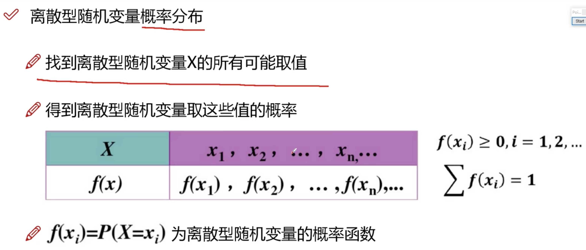

概率密度
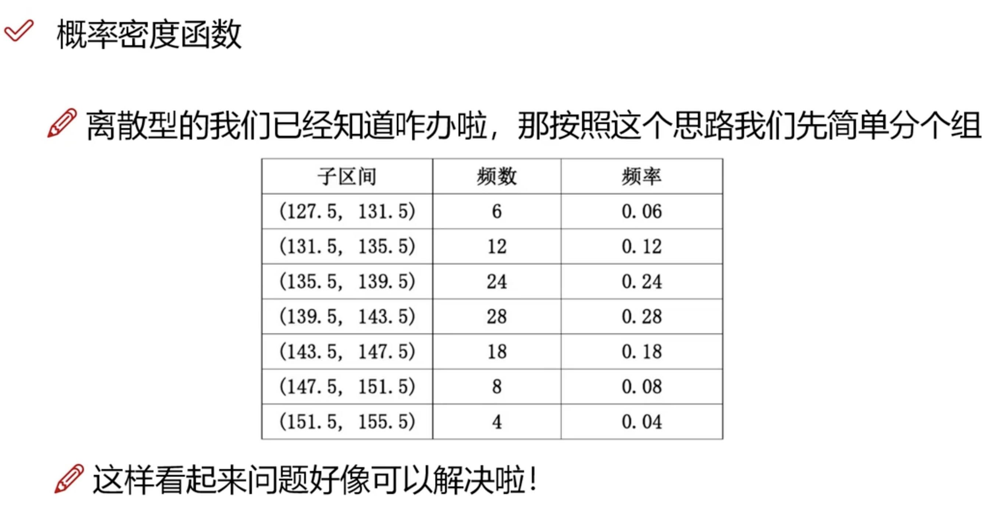

简单随机抽样
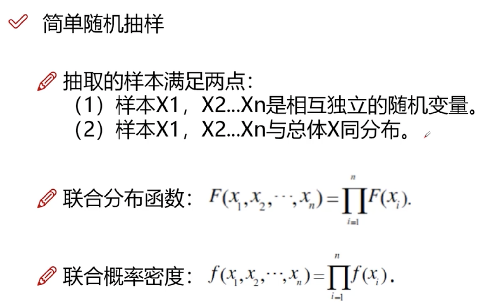

# 似然函数
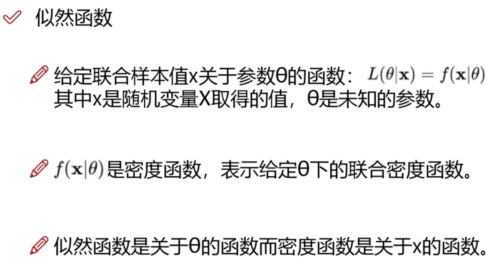
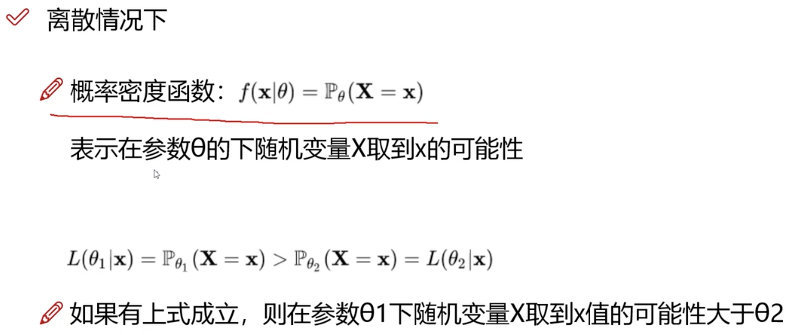
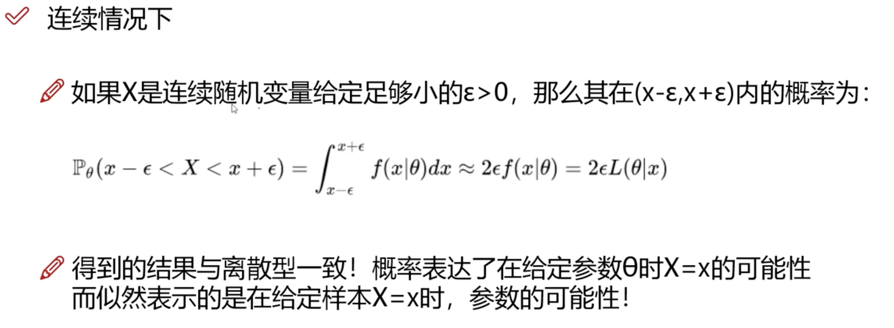

似然函数（Likelihood Function）是统计学中的一个概念，用于描述观测数据对于某个概率分布的拟合程度。具体来说，似然函数是指，在给定一组观测数据的情况下，某个参数值的概率密度函数（或概率质量函数）的取值。似然函数通常用 $L(\theta|x)$ 表示，其中 $\theta$ 是概率分布的参数，$x$ 是观测数据。

似然函数的意义是：在已知观测数据的情况下，通过改变概率分布的参数 $\theta$，来寻找最符合观测数据的概率分布。因此，似然函数通常被用来作为参数估计的依据，目标是寻找最大化似然函数的参数值。

通常，似然函数的取值越大，说明观测数据和概率分布的拟合程度越好。因此，最大化似然函数的参数值被认为是最符合观测数据的参数值。在实际应用中，通常使用对数似然函数来代替原始的似然函数，因为对数似然函数具有更好的数学性质，同时也更容易计算和优化。

总之，似然函数是参数估计中的一个重要概念，常用于模型的训练和优化过程中。它可以帮助我们评估模型对观测数据的拟合程度，并通过最大化似然函数来寻找最优的模型参数。

## 极大似然估计

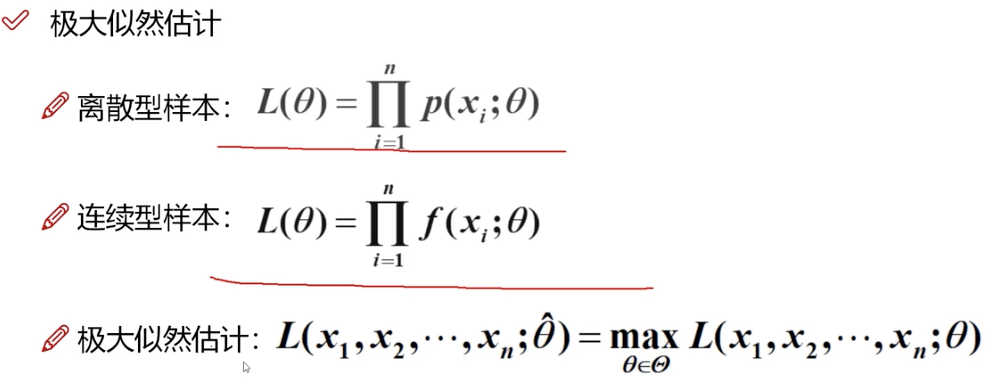
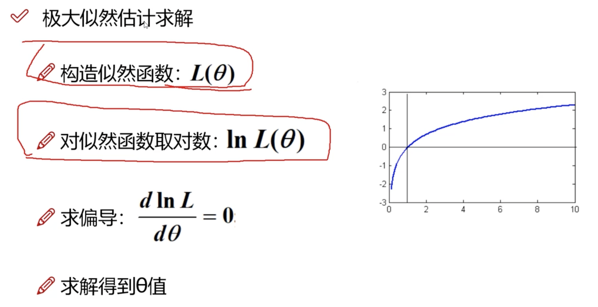

# 概率论
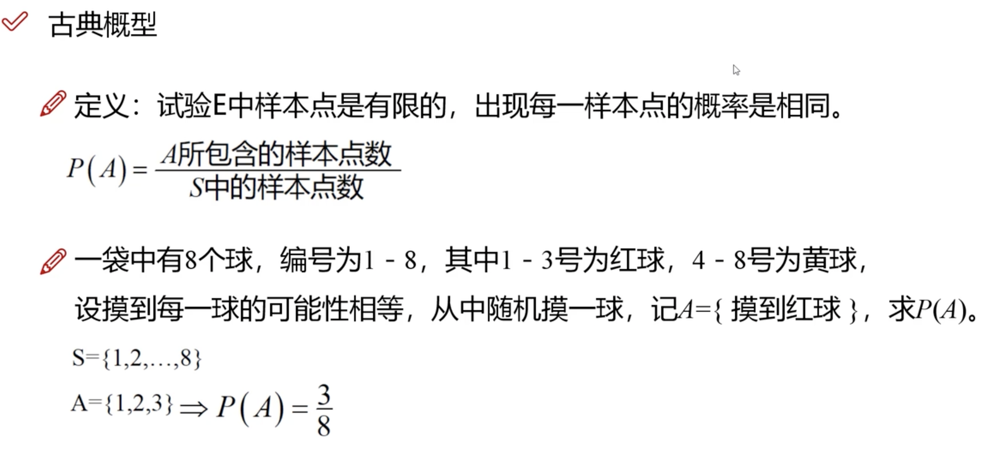

## 条件概率
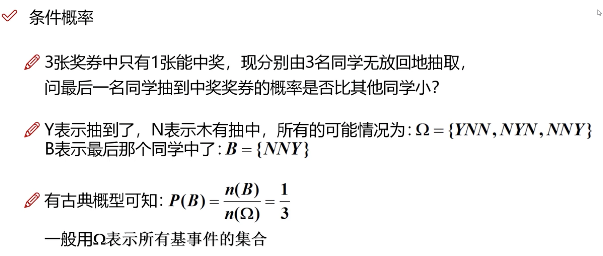
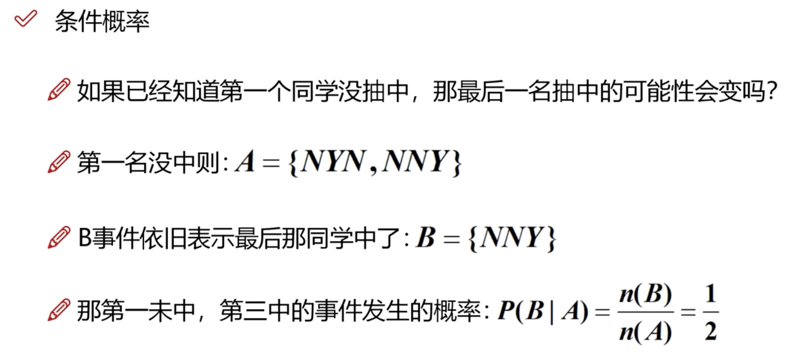
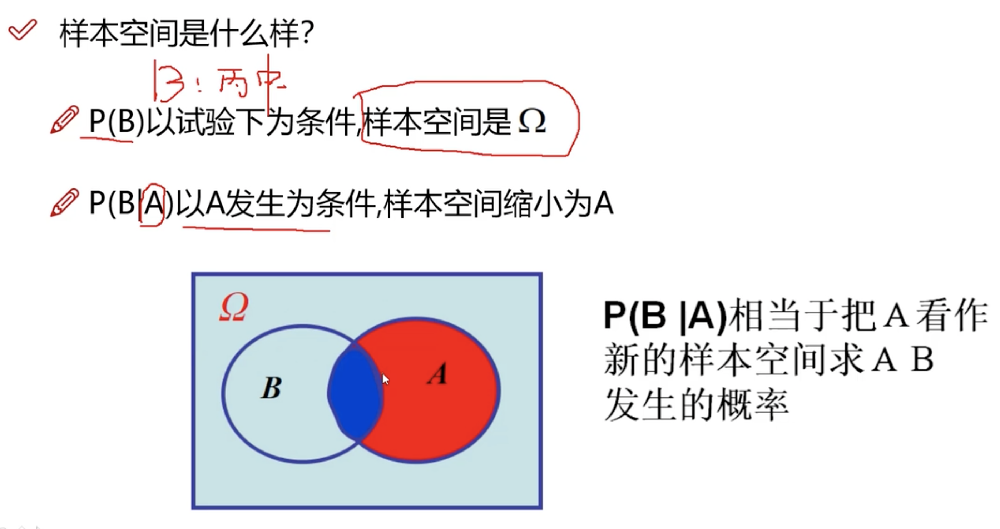
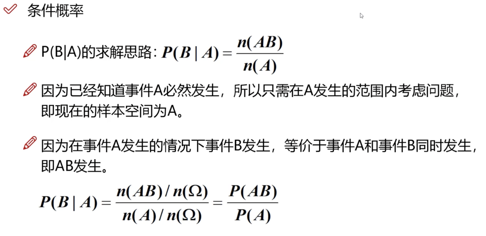

## 独立性
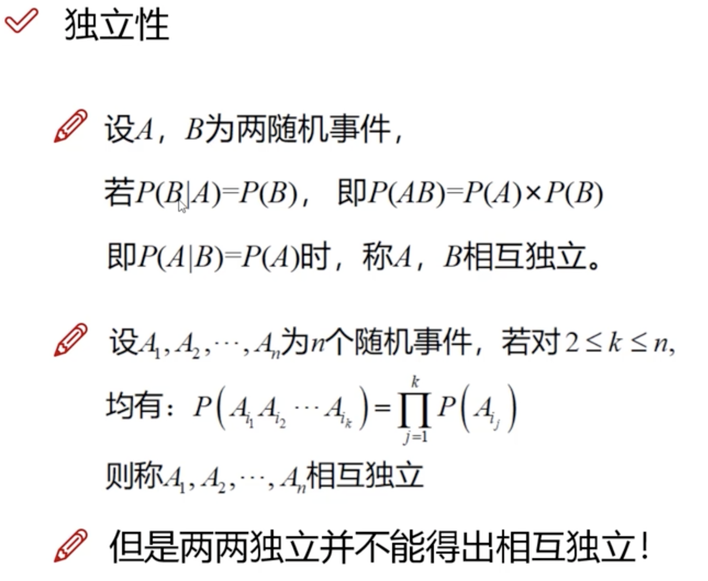

## 独立实验

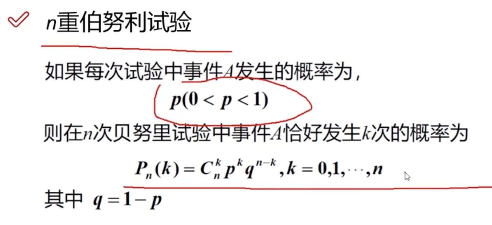

## 二维随机变量
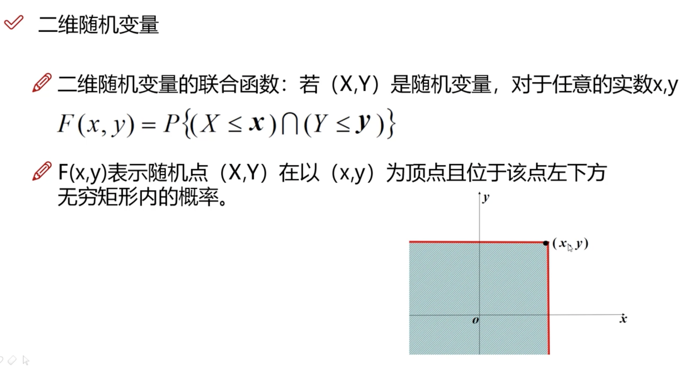
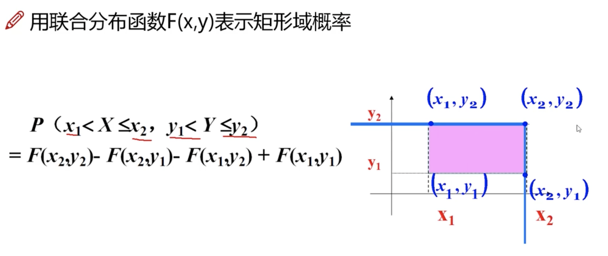
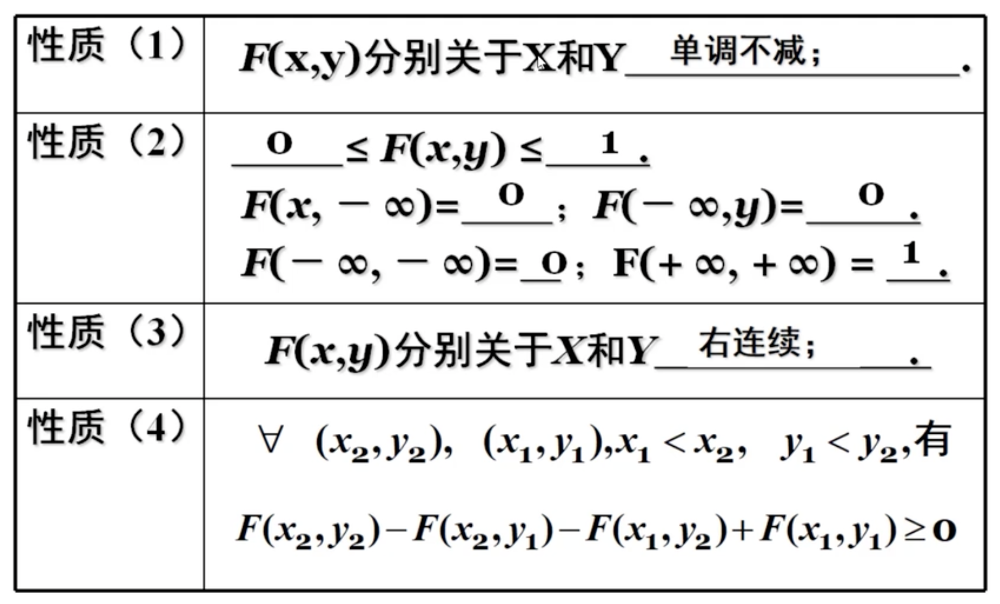
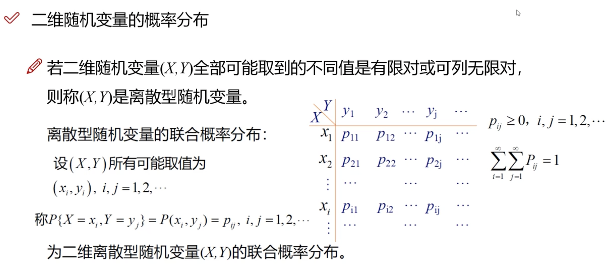
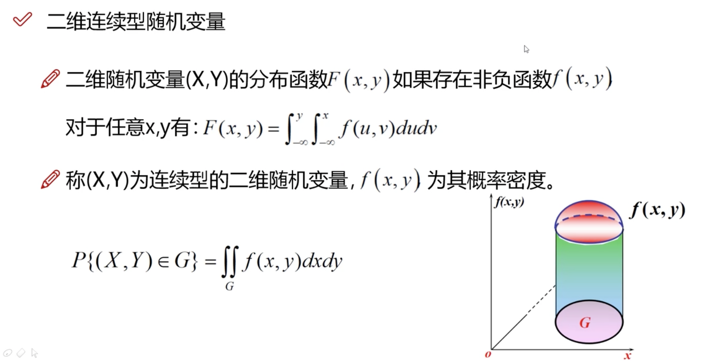

### 边缘分布
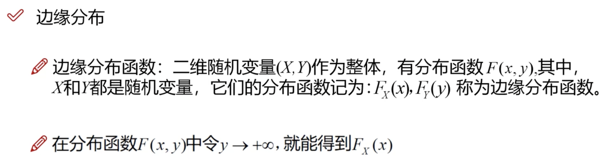

