# 函数
- 函数的定义
  - 量和量之间的关系如：$A=\pi r^2$
  - $y = f(x)$其中x是自变量，y是因变量
  - 函数在$x_{0}$处取得的函数值$y_{0}=y \mid _{x=x_{0}} = f(x_{0})$
  - 符号只是一种表示，也可以：$y=g(x)$、$y=\phi(x)$
- 函数分类
  - 分段函数：$f(x)=\left\{ \begin{aligned} \sqrt[2]{x}, & \quad x \leq 0 \\ -x, & \quad x > 0 \end{aligned} \right.$
  - 反函数：$h=\frac{1}{2}gt^2 \rightarrow h = h(t) $ 
  $ t = \sqrt[]{\frac{2h}{g}} \rightarrow t = t(h)$
  - 显函数与隐函数：$y=x^2+1$   ____  $F(x,y) = 0$
- 几种特性
  - 奇偶性：
    - 偶函数：y轴对称
    - 奇函数：原点对称
  - 周期性：$f(x+T)=f(x)$
  - 单调性

# 极限
## 数列
按照一定次序排列的一列数：$u_{1},u_{2},\dots , u_{n}, \dots$，其中$u_{n}$叫做通项
对于数列$\{u_{n}\}$，如果当n无限增大时，其通项无限接近于一个常数A，则称该数列以A为极限或称数列收敛域A，否则称数列为发散
$\lim\limits_{n \to \infty} A$ 或 $u_{n} \rightarrow A (n \rightarrow \infty)$

## 极限
- 符号表示
   - $x \rightarrow \infty$ 表示“当$\left|x\right|$无限增大时”
   - $x \rightarrow +\infty$ 表示“当$x$无限增大时”
   - $x \rightarrow -\infty$ 表示“当$x$无限减小时”
   - $x \rightarrow x_{0}$ 表示“当$x$从$x_{0}$的左右两侧无限接近于$x_{0}$时”
   - $x \rightarrow x_{0}^+$ 表示“当$x$从$x_{0}$的右侧无限接近于$x_{0}$时”
   - $x \rightarrow x_{0}^-$ 表示“当$x$从$x_{0}$的左侧无限接近于$x_{0}$时”- 
- 函数在$x_{0}$的邻域内有定义，$\lim\limits_{x \to x} f(x)=A$或$f(x)\rightarrow A(x\rightarrow x_{0})$
- 左右极限：函数在左半邻域/右半邻域内有定义$\begin{aligned}(x_{0}, x_{0}+\omega) \\ (x_{0}-\omega, x_{0}) \end{aligned}$
    $\lim\limits_{x \to x_{0}^+} f(x)=A \quad \text{or} \quad f(x) \rightarrow a(x \rightarrow A(x \rightarrow x_{0}^+)) \quad \text{ot} \quad f(x_{0} + 0) = A$
    $\lim\limits_{x \to x_{0}^-} f(x)=A \quad \text{or} \quad f(x) \rightarrow a(x \rightarrow A(x \rightarrow x_{0}^-)) \quad \text{ot} \quad f(x_{0} - 0) = A$
- $\lim\limits_{x \to x_{0}}f(x)=A$的充要条件是$\lim\limits_{x \to x_{0}^-}f(x) = \lim\limits_{x \to x_{0}^+}f(x)=A$（即左右极限存在且相等）
- 无穷小：以零为极限
  - 基本性质
  - 有限个无穷小的代数和仍是无穷小
  - 有限个无穷小的积仍是无穷小
  - 有界变量与无穷小的积仍是无穷小
  - 无限个无小只和不一定是无穷小

# 导数
## 函数的连续性
设函数在$f=f(x)$在点x的某邻域内有定义，如果当自变量的改变量$\Delta x$趋近于0时，相应函数的改变量$\Delta y$也趋近于0，则称$y=f(x)$在点x处连续
$$\lim_{\Delta x \to 0} \Delta y = \lim_{\Delta x \to 0}\left[f(x_{0} + \Delta x) - f(x_{0})\right] = 0$$

函数$f(x)$在点$x_{0}$处连续，需要满足条件：
1. 函数在该点处有定义
2. 函数在该点处极限$\lim\limits_{x \to x_{0}}f(x)$存在
3. 极限值等于函数值$f(x_{0})$

函数的间断点：
- 函数$f(x)$在$x_{0}$处不连续，则称其为函数的间断点
- 3种情况
  - 在$x_{0}$处没有定义
  - 极限$\lim\limits_{x \to x_{0}}f(x)$不存在
  - 满足前两点，但是$\lim\limits_{x \to x_{0}}f(x) \neq f(x)$

间断点分类：
- 在一点左右极限都存在，为一类间断点，否则为二类间断点
- 跳跃间断点：一点左右极限都存在但不相等
- 可去间断点：一点极限存在但与函数值不相等

导数：
- 如果平均变化率的极限存在，$\lim\limits_{\Delta x \to 0}\frac{\Delta y}{\Delta x} = \lim\limits_{\Delta x \to 0}\frac{f(x_{0}+\Delta x)-f(x_{0})}{\Delta x}$，则称此极限为函数$y=f(x)$在点$x_{0}$处的导数$f^{'}(x_{0})$ $$y^{'}\mid _{x=x_{0}} \quad \text{or} \quad \frac{\mathrm{d}y}{\mathrm{d}x}\bigg|_{x=x_0} \quad \text{or} \quad \frac{\mathrm{d}f(x)}{\mathrm{d}x}\bigg|_{x=x_{0}}$$

## 偏导数
对于一元函数$y=f(x)$只存在y随x的变化，二元函数$z=f(x, y)$存在z随x变化的变化率，随y变化的变化率，随x、y同时变化的变化率
定义：设函数$z=f(x,y)$在点$(x_{0}, y_{0})$的某个邻域内有定义，定$y=y_{0}$，一元函数$f(x, x_{0})$在点$x=x_{0}$处可导，即极限$$\lim_{\Delta x \to 0} \frac{f(x_{0}+\Delta x, y_{0})-f(x_{0}, y_{0})}{\Delta x} = A$$  则称A为函数$z=f(x,y)$在点$(x_{0}, y_{0})$处关于自变量x的偏导数，记作$f_{x}(x_{0}, y_{0}) \quad \text{or} \quad \frac{ \partial z }{\partial x}\bigg|_{\begin{aligned}x=x_{0} \\ y=y_{0} \end{aligned}} \quad \text{or} \quad \frac{ \partial f }{\partial x}\bigg|_{\begin{aligned}x=x_{0} \\ y=y_{0} \end{aligned}} \quad \text{or} \quad z_{x}\bigg|_{\begin{aligned}x=x_{0} \\ y=y_{0} \end{aligned}}$

几何意义：
对于x的偏导数，相当于y固定的那一个面的其中一点位置的切线相对于x轴的斜率，对y偏导亦然

## 方向导数
函数$z=f(x,y)$
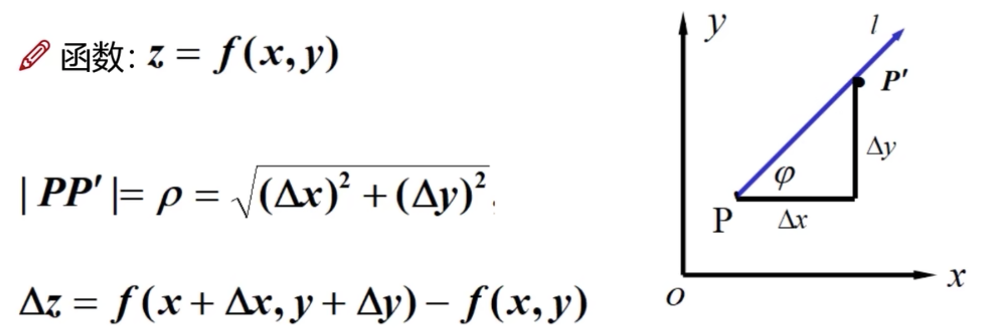

如果函数的增量，与这两点距离的比例存在，则称此为在P点沿着L的方向导数$$\frac{\partial f}{\partial l}=\lim_{\rho \to 0} \frac{f(x+\Delta x, y+\Delta y) - f(x,y)}{\rho}$$

函数：$f(x,y)$在x轴正向$\vec{e}_{1}=\{1, 0\}$，y轴正向$\vec{e}_{2}=\{0,1\}$的方向导数分别为$f_{x} \quad f_{y}$

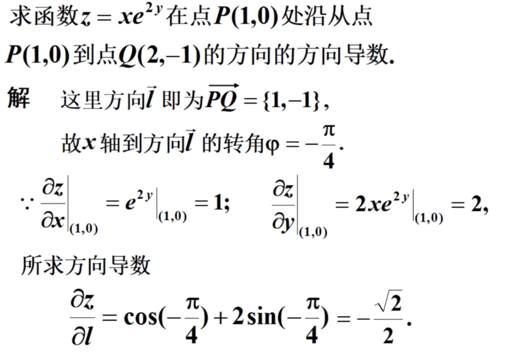

## 梯度
函数：$z=f(x,y)$在平面域内具有连续的一阶偏导数，对于其中每一个点$P(x,y)$都有向量$\frac{\partial f}{\partial x}\vec{i}+\frac{\partial f}{\partial y}\vec{j}$，则称其为函数在点P的梯度。$$\nabla f(x,y)=\frac{\partial f}{\partial x}\vec{i}+\frac{\partial f}{\partial y}\vec{j}$$

$\vec{e} = cos\psi\vec{i}+sin\psi\vec{j}$是方向L上的单位向量
$\frac{\partial f}{\partial l} = \frac{\partial f}{\partial x}cos\psi + \frac{\partial f}{\partial y}sin\psi = \{\frac{\partial f}{\partial x},\frac{\partial f}{\partial y}\}\cdot\{cos\psi, sin\psi\}$
$=\nabla f(x,y)\cdot \vec{e} = |\nabla f(x,y)|cos\theta \quad \theta=(\nabla f(x,y), \vec{e})$
只有在$\theta=0$是，梯度才能取得最大值
函数在某点的梯度是一个向量，他的方向与方向的导数最大值取得的方向一致，其大小正好是最大的方向导数

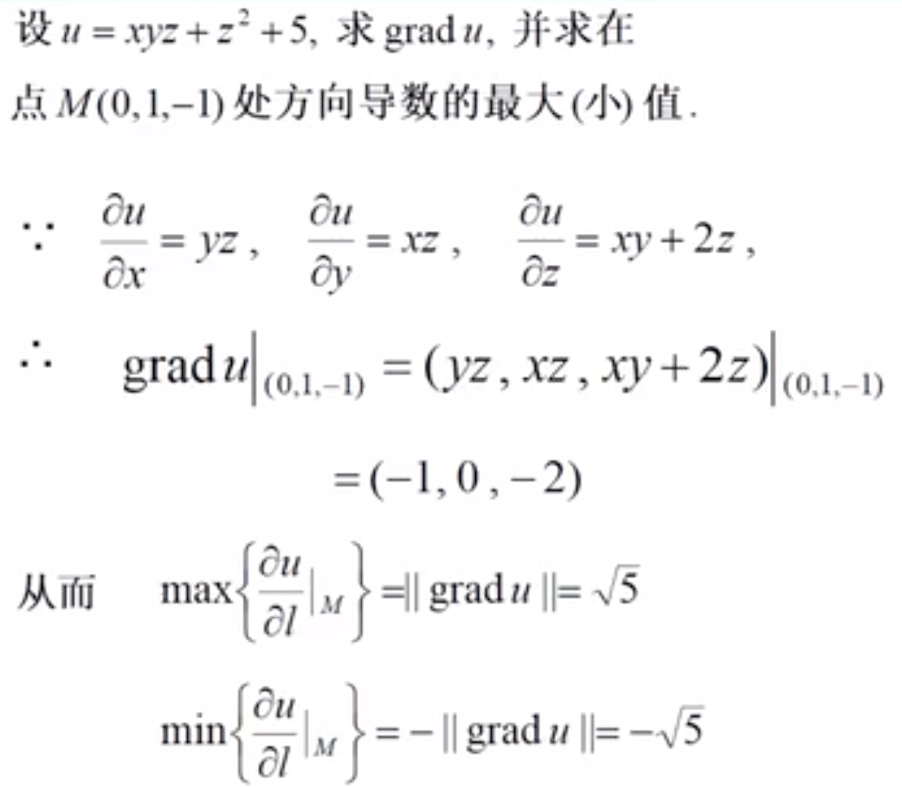

在数学和机器学习中，梯度是一个向量，表示一个函数在某个点处的变化率最快的方向和速率。具体来说，对于一个多元函数 $f(x_1, x_2, \cdots, x_n)$，在点 $(x_1^0, x_2^0, \cdots, x_n^0)$ 处的梯度 $\nabla f(x_1^0, x_2^0, \cdots, x_n^0)$ 是一个向量：

$$
\nabla f(x_1^0, x_2^0, \cdots, x_n^0) = \begin{bmatrix}
\frac{\partial f}{\partial x_1}(x_1^0, x_2^0, \cdots, x_n^0) \\
\frac{\partial f}{\partial x_2}(x_1^0, x_2^0, \cdots, x_n^0) \\
\vdots \\
\frac{\partial f}{\partial x_n}(x_1^0, x_2^0, \cdots, x_n^0)
\end{bmatrix}
$$

其中，$\frac{\partial f}{\partial x_i}(x_1^0, x_2^0, \cdots, x_n^0)$ 是函数 $f$ 在 $(x_1^0, x_2^0, \cdots, x_n^0)$ 处对 $x_i$ 的偏导数。

梯度的几何意义是函数在某个点处的变化率最快的方向和速率。具体地，对于一个多元函数 $f(x_1, x_2, \cdots, x_n)$，在点 $(x_1^0, x_2^0, \cdots, x_n^0)$ 处，函数 $f$ 在梯度 $\nabla f(x_1^0, x_2^0, \cdots, x_n^0)$ 的方向上的变化率最大，其变化率为：

$$
\frac{\partial f}{\partial \mathbf{u}}(x_1^0, x_2^0, \cdots, x_n^0) = \nabla f(x_1^0, x_2^0, \cdots, x_n^0) \cdot \mathbf{u}
$$

其中，$\mathbf{u}$ 是一个单位向量，表示梯度的方向。因为 $\mathbf{u}$ 是单位向量，所以 $\nabla f(x_1^0, x_2^0, \cdots, x_n^0) \cdot \mathbf{u}$ 等于梯度向量在 $\mathbf{u}$ 方向上的投影长度，也就是函数在梯度方向上的变化率。因此，梯度的方向是函数变化率最快的方向，梯度的模长表示函数的变化率。

梯度在机器学习中有广泛的应用，特别是在优化算法中。例如，梯度下降算法是一种常用的优化算法，用于求解最小化某个函数的问题。在梯度下降算法中，每次迭代的方向就是梯度的方向，迭代步长的大小可以通过学习率来控制。

# 微积分
$$\mathrm{d}f(x) = \frac{\mathrm{d}f(x)}{\mathrm{d}x}\mathrm{d}x\quad \frac{\partial f(x,y)}{\partial x}\quad \int f(x)\mathrm{d}x\quad \int_{a}^{b} f(x)\mathrm{d}x$$

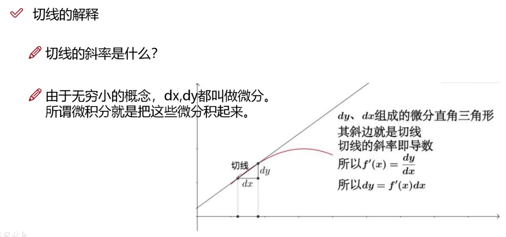

微分是什么？
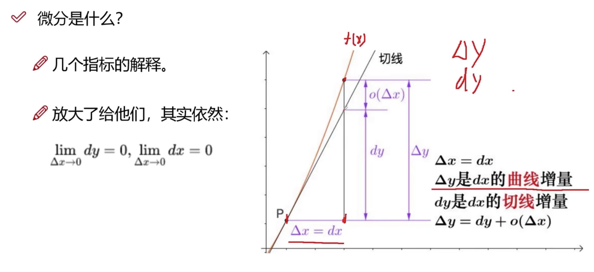
$\Delta x = \mathrm{d}x$
$\Delta y$是经过$\Delta x$后函数值的变化量
$\mathrm{d} y$是经过$\Delta x$后在切线上的变化量

## 定积分
当$\left\|\Delta x\right\|\rightarrow 0$时，总和S总是趋于确定的极限I，则称极限I为函数$f(x)$在曲线$[a,b]$上的定积分
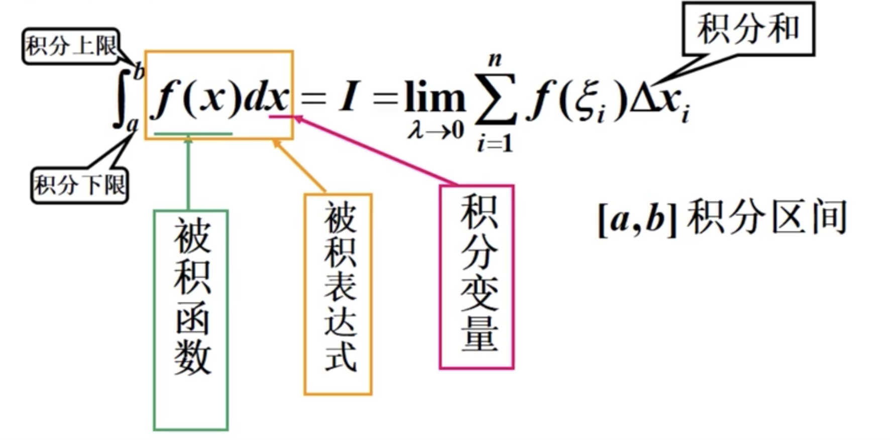

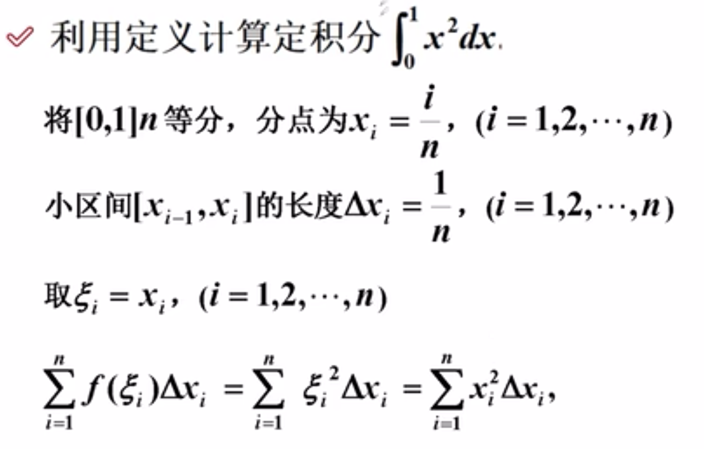
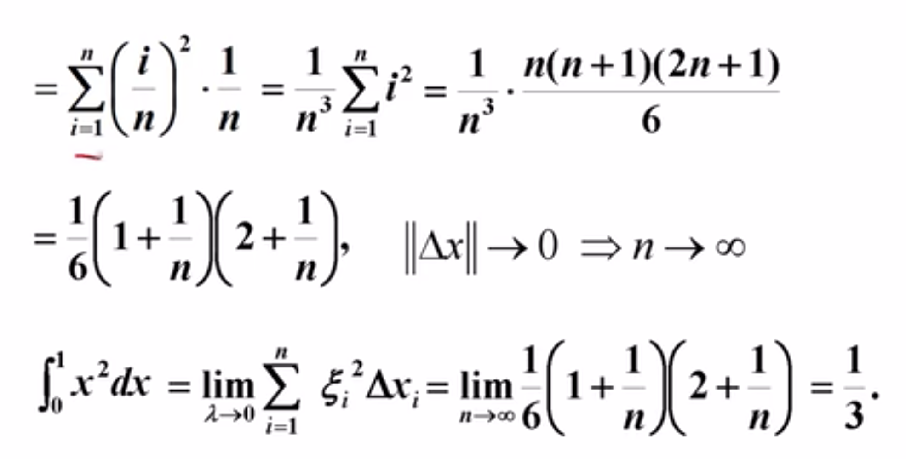  

## 牛顿——莱布尼兹公式
如果$F(x)$是连续函数$f(x)$在区间$[a,b]$上的一个原函数，则：$$\int_{a}^{b}f(x)\mathrm{d}x=F(b)-F(a)$$
即：一个连续函数在区间$[a,b]$上的定积分等于他的任意一个原函数在区间$[a,b]$上的增量

## 基本公式
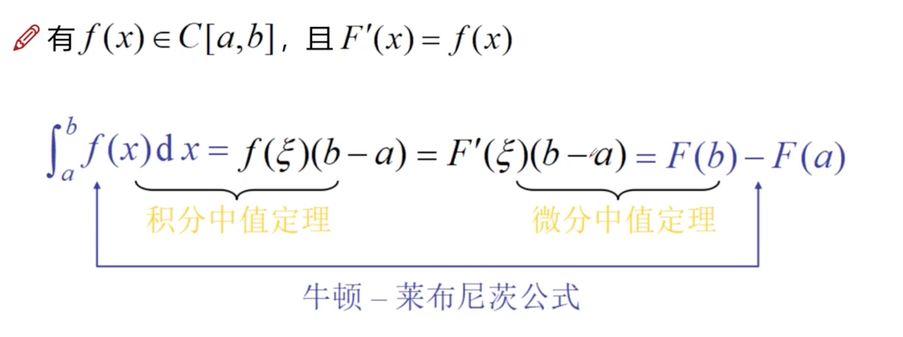

# 泰勒公式
出发点
- 用简单的熟悉的多项式来近似代替复杂的函数
- 易计算函数值，导数与积分仍是多项式
- 多项式由他的系数完全确定，其系数又由他在一点的函数值及其导数所确定

泰勒多项式：$$P_{n}(x)=f(x_{0})+f^{'}(x_{0})(x-x_0)+\frac{f^{"}(x_0)}{2!}(x-x_0)^2+\dots+\frac{f^{(n)}(x_0)}{n!}(x-x_0)^n$$
称为$f(x)$的在$x_0$关于$(x-x_0)$的n阶泰勒多项式

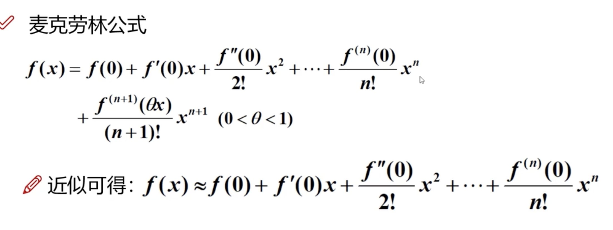

在$x=0$处的泰勒公式变成麦克劳林公式

- 阶数是什么意思呢
  - 阶数越高，增长速度越快
  - 越高次项在越偏右侧影响越大
  - 对于一个复杂函数，低阶函数更能描述当前点附近，而对于之后的走势越来越依靠高阶的
- 阶乘是什么意思呢
  - 低阶的特性被高阶完全压制，高阶的幂函数增长太快
  - 阶乘可以先体现低阶的特性，再体现高阶的特性

# 拉格朗日乘子法
如何求极值？
给个函数：$z=f(x,y)$如何求其极值点？
简单来说直接求他的偏导不就行了？
$f_x(x,y) = 0 \quad f_y(x,y)=0$
现在问题难度加大了，如果加上约束条件呢？面积固定，求体积最大=？
$V(x,y,z)=xyz$
$2xy+2yz+2zx=S$
拉格朗日乘子法（Lagrange multiplier method）是一种求解带有约束条件的优化问题的方法。它是由意大利数学家拉格朗日（Joseph-Louis Lagrange）在18世纪提出的。拉格朗日乘子法的基本思想是将带有约束条件的优化问题转化为不带约束条件的优化问题，通过引入拉格朗日乘子来实现这一转化。
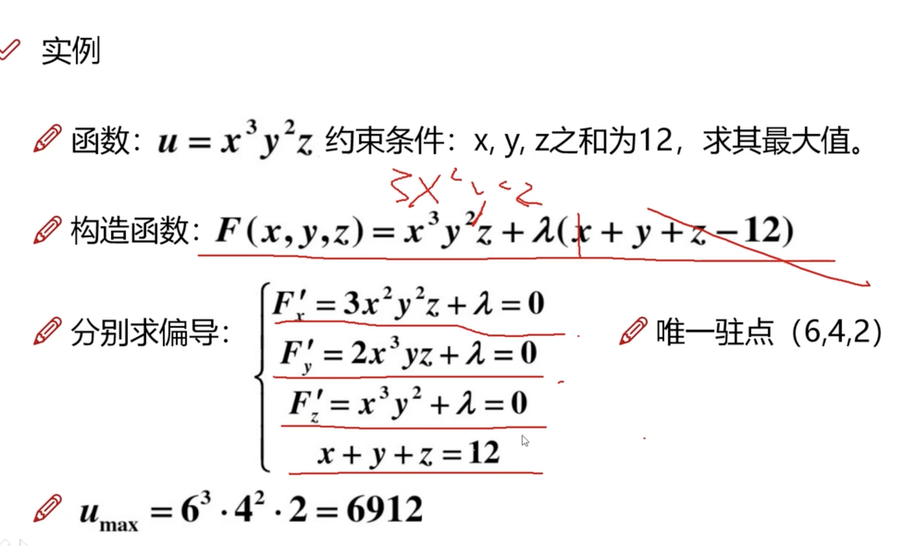

