# 第1章 准备工作
本书讲的是利用Python进行数据控制、处理、整理、分析等方面的具体细节和基本要点。我的目标是介绍Python编程和用于数据处理的库和工具环境，掌握这些，可以让你成为一个数据分析专家。虽然本书的标题是“数据分析”，重点却是Python编程、库，以及用于数据分析的工具。这就是数据分析要用到的Python编程。

当书中出现“数据”时，究竟指的是什么呢？主要指的是结构化数据（structured data），这个故意含糊其辞的术语代指了所有通用格式的数据，例如：
- 表格型数据，其中各列可能是不同的类型（字符串、数值、日期等）。比如保存在关系型数据库中或以制表符/逗号为分隔符的文本文件中的那些数据。
- 多维数组（矩阵）。
- 通过关键列（对于SQL用户而言，就是主键和外键）相互联系的多个表。
- 间隔平均或不平均的时间序列。

## 重要的Python库

### NumPy
NumPy（Numerical Python的简称）是Python科学计算的基础包。本书大部分内容都基于NumPy以及构建于其上的库。它提供了以下功能（不限于此）：
- 快速高效的多维数组对象ndarray。
- 用于对数组执行元素级计算以及直接对数组执行数学运算的函数。
- 用于读写硬盘上基于数组的数据集的工具。
- 线性代数运算、傅里叶变换，以及随机数生成。
- 成熟的C API， 用于Python插件和原生C、C++、Fortran代码访问NumPy的数据结构和计算工具。

### pandas
pandas提供了快速便捷处理结构化数据的大量数据结构和函数。自从2010年出现以来，它助使Python成为强大而高效的数据分析环境。本书用得最多的pandas对象是DataFrame，它是一个面向列（column-oriented）的二维表结构，另一个是Series，一个一维的标签化数组对象。
pandas兼具NumPy高性能的数组计算功能以及电子表格和关系型数据库（如SQL）灵活的数据处理功能。它提供了复杂精细的索引功能，能更加便捷地完成重塑、切片和切块、聚合以及选取数据子集等操作。因为数据操作、准备、清洗是数据分析最重要的技能，pandas是本书的重点。

### matplotlib
matplotlib是最流行的用于绘制图表和其它二维数据可视化的Python库。它最初由John D.Hunter（JDH）创建，目前由一个庞大的开发团队维护。它非常适合创建出版物上用的图表。虽然还有其它的Python可视化库，matplotlib却是使用最广泛的，并且它和其它生态工具配合也非常完美。我认为，可以使用它作为默认的可视化工具。

### IPython和Jupyter

### SciPy
SciPy是一组专门解决科学计算中各种标准问题域的包的集合，主要包括下面这些包：
- scipy.integrate：数值积分例程和微分方程求解器。
- scipy.linalg：扩展了由numpy.linalg提供的线性代数例程和矩阵分解功能。
- scipy.optimize：函数优化器（最小化器）以及根查找算法。
- scipy.signal：信号处理工具。
- scipy.sparse：稀疏矩阵和稀疏线性系统求解器。
- scipy.special：SPECFUN（这是一个实现了许多常用数学函数（如伽玛函数）的Fortran库）的包装器。
- scipy.stats：标准连续和离散概率分布（如密度函数、采样器、连续分布函数等）、各种统计检验方法，以及更好的描述统计法。
NumPy和SciPy结合使用，便形成了一个相当完备和成熟的计算平台，可以处理多种传统的科学计算问题。

### scikit-learn
2010年诞生以来，scikit-learn成为了Python的通用机器学习工具包。仅仅七年，就汇聚了全世界超过1500名贡献者。它的子模块包括：
- 分类：SVM、近邻、随机森林、逻辑回归等等。
- 回归：Lasso、岭回归等等。
- 聚类：k-均值、谱聚类等等。
- 降维：PCA、特征选择、矩阵分解等等。
- 选型：网格搜索、交叉验证、度量。
- 预处理：特征提取、标准化。
与pandas、statsmodels和IPython一起，scikit-learn对于Python成为高效数据科学编程语言起到了关键作用。虽然本书不会详细讲解scikit-learn，我会简要介绍它的一些模型，以及用其它工具如何使用这些模型。


# 第2章 Python语法基础，IPython和Jupyter Notebooks

## ipython

### 运行IPython Shell
你可以用`ipython`在命令行打开IPython Shell，就像打开普通的Python解释器：

你可以通过输入代码并按Return（或Enter），运行任意Python语句。当你只输入一个变量，它会显示代表的对象：

### 运行Jupyter Notebook
要启动Jupyter，在命令行中输入`jupyter notebook`


# 第4章 Numpy基础
NumPy（Numerical Python的简称）是Python数值计算最重要的基础包。大多数提供科学计算的包都是用NumPy的数组作为构建基础。
NumPy的部分功能如下：
- ndarray，一个具有矢量算术运算和复杂广播能力的快速且节省空间的多维数组。
- 用于对整组数据进行快速运算的标准数学函数（无需编写循环）。
- 用于读写磁盘数据的工具以及用于操作内存映射文件的工具。
- 线性代数、随机数生成以及傅里叶变换功能。
- 用于集成由C、C++、Fortran等语言编写的代码的A C API。

NumPy之于数值计算特别重要的原因之一，是因为它可以高效处理大数组的数据。这是因为：
- NumPy是在一个连续的内存块中存储数据，独立于其他Python内置对象。NumPy的C语言编写的算法库可以操作内存，而不必进行类型检查或其它前期工作。比起Python的内置序列，NumPy数组使用的内存更少。
- NumPy可以在整个数组上执行复杂的计算，而不需要Python的for循环。


## NumPy的ndarray：一种多维数组对象
NumPy最重要的一个特点就是其N维数组对象（即ndarray），该对象是一个快速而灵活的大数据集容器。你可以利用这种数组对整块数据执行一些数学运算，其语法跟标量元素之间的运算一样。

### 创建 ndarray
创建数组最简单的办法就是使用`array`函数。它接受一切序列型的对象（包括其他数组），然后产生一个新的含有传入数据的NumPy数组。以一个列表的转换为例：
```py
In [19]: data1 = [6, 7.5, 8, 0, 1]

In [20]: arr1 = np.array(data1)

In [21]: arr1
Out[21]: array([ 6. ,  7.5,  8. ,  0. ,  1. ])
```

嵌套序列（比如由一组等长列表组成的列表）将会被转换为一个多维数组：
```py
In [22]: data2 = [[1, 2, 3, 4], [5, 6, 7, 8]]

In [23]: arr2 = np.array(data2)

In [24]: arr2
Out[24]: 
array([[1, 2, 3, 4],
       [5, 6, 7, 8]])
```
因为data2是列表的列表，NumPy数组arr2的两个维度的shape是从data2引入的。可以用属性ndim和shape验证：
```py
In [25]: arr2.ndim
Out[25]: 2

In [26]: arr2.shape
Out[26]: (2, 4)
```

除`np.array`之外，还有一些函数也可以新建数组。比如，`zeros`和`ones`分别可以创建指定长度或形状的全0或全1数组。`empty`可以创建一个没有任何具体值的数组。要用这些方法创建多维数组，只需传入一个表示形状的元组即可：
```py
In [29]: np.zeros(10)
Out[29]: array([ 0.,  0.,  0.,  0.,  0.,  0.,  0.,  0.,  0.,  0.])

In [30]: np.zeros((3, 6))
Out[30]: 
array([[ 0.,  0.,  0.,  0.,  0.,  0.],
       [ 0.,  0.,  0.,  0.,  0.,  0.],
       [ 0.,  0.,  0.,  0.,  0.,  0.]])

In [31]: np.empty((2, 3, 2))
Out[31]: 
array([[[ 0.,  0.],
        [ 0.,  0.],
        [ 0.,  0.]],
       [[ 0.,  0.],
        [ 0.,  0.],
        [ 0.,  0.]]])
```
`arange`是Python内置函数`range`的数组版：
```py
In [32]: np.arange(15)
Out[32]: array([ 0,  1,  2,  3,  4,  5,  6,  7,  8,  9, 10, 11, 12, 13, 14])
```

表4-1列出了一些数组创建函数。由于NumPy关注的是数值计算，因此，如果没有特别指定，数据类型基本都是float64（浮点数）。
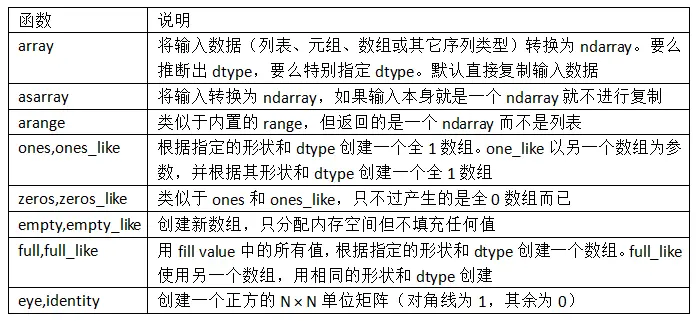

### ndarray的数据类型
dtype（数据类型）是一个特殊的对象，它含有ndarray将一块内存解释为特定数据类型所需的信息：
```py
In [33]: arr1 = np.array([1, 2, 3], dtype=np.float64)

In [34]: arr2 = np.array([1, 2, 3], dtype=np.int32)

In [35]: arr1.dtype
Out[35]: dtype('float64')

In [36]: arr2.dtype
Out[36]: dtype('int32')
```
dtype是NumPy灵活交互其它系统的源泉之一。多数情况下，它们直接映射到相应的机器表示，这使得“读写磁盘上的二进制数据流”以及“集成低级语言代码（如C、Fortran）”等工作变得更加简单。数值型dtype的命名方式相同：一个类型名（如float或int），后面跟一个用于表示各元素位长的数字。标准的双精度浮点值（即Python中的float对象）需要占用8字节（即64位）。因此，该类型在NumPy中就记作float64。表4-2列出了NumPy所支持的全部数据类型。
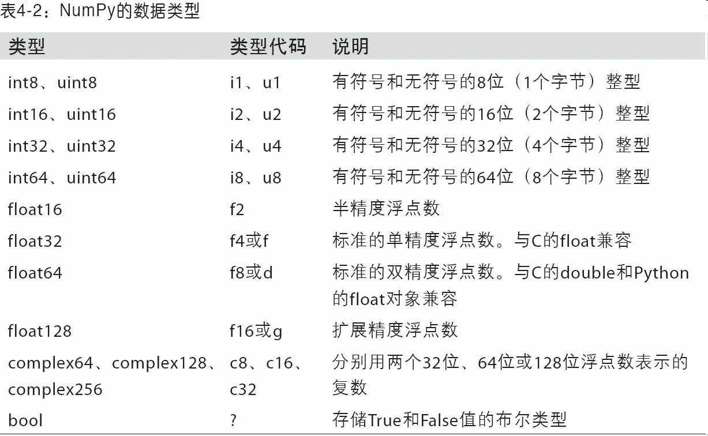
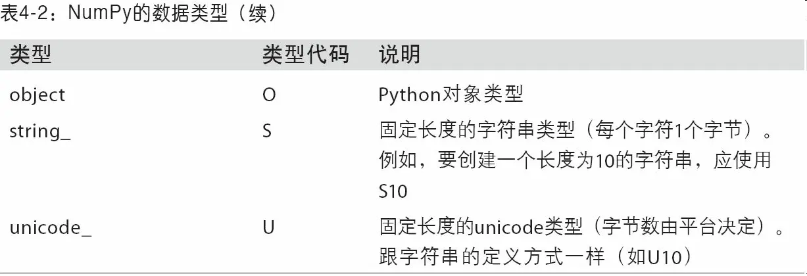


你可以通过ndarray的`astype`方法明确地将一个数组从一个dtype转换成另一个dtype：
```py
In [37]: arr = np.array([1, 2, 3, 4, 5])

In [38]: arr.dtype
Out[38]: dtype('int64')

In [39]: float_arr = arr.astype(np.float64)

In [40]: float_arr.dtype
Out[40]: dtype('float64')
```
在本例中，整数被转换成了浮点数。如果将浮点数转换成整数，则小数部分将会被截取删除：
```py
In [41]: arr = np.array([3.7, -1.2, -2.6, 0.5, 12.9, 10.1])

In [42]: arr
Out[42]: array([  3.7,  -1.2,  -2.6,   0.5,  12.9,  10.1])

In [43]: arr.astype(np.int32)
Out[43]: array([ 3, -1, -2,  0, 12, 10], dtype=int32)
```

如果某字符串数组表示的全是数字，也可以用astype将其转换为数值形式：
```py
In [44]: numeric_strings = np.array(['1.25', '-9.6', '42'], dtype=np.string_)

In [45]: numeric_strings.astype(float)
Out[45]: array([  1.25,  -9.6 ,  42.  ])
```

### NumPy数组的运算
数组很重要，因为它使你不用编写循环即可对数据执行批量运算。NumPy用户称其为矢量化（vectorization）。大小相等的数组之间的任何算术运算都会将运算应用到元素级：
```py
In [51]: arr = np.array([[1., 2., 3.], [4., 5., 6.]])

In [52]: arr
Out[52]: 
array([[ 1.,  2.,  3.],
       [ 4.,  5.,  6.]])

In [53]: arr * arr
Out[53]: 
array([[  1.,   4.,   9.],
       [ 16.,  25.,  36.]])

In [54]: arr - arr
Out[54]: 
array([[ 0.,  0.,  0.],
       [ 0.,  0.,  0.]])
```
数组与标量的算术运算会将标量值传播到各个元素：
```py
In [55]: 1 / arr
Out[55]: 
array([[ 1.    ,  0.5   ,  0.3333],
       [ 0.25  ,  0.2   ,  0.1667]])

In [56]: arr ** 0.5
Out[56]: 
array([[ 1.    ,  1.4142,  1.7321],
       [ 2.    ,  2.2361,  2.4495]])
```

大小相同的数组之间的比较会生成布尔值数组：
```py
In [57]: arr2 = np.array([[0., 4., 1.], [7., 2., 12.]])

In [58]: arr2
Out[58]: 
array([[  0.,   4.,   1.],
       [  7.,   2.,  12.]])

In [59]: arr2 > arr
Out[59]:
array([[False,  True, False],
       [ True, False,  True]], dtype=bool)
```

### 基本的索引和切片
NumPy数组的索引是一个内容丰富的主题，因为选取数据子集或单个元素的方式有很多。一维数组很简单。从表面上看，它们跟Python列表的功能差不多：
```py
In [60]: arr = np.arange(10)

In [61]: arr
Out[61]: array([0, 1, 2, 3, 4, 5, 6, 7, 8, 9])

In [62]: arr[5]
Out[62]: 5

In [63]: arr[5:8]
Out[63]: array([5, 6, 7])

In [64]: arr[5:8] = 12

In [65]: arr
Out[65]: array([ 0,  1,  2,  3,  4, 12, 12, 12,  8,  9])
```
如上所示，当你将一个标量值赋值给一个切片时（如arr[5:8]=12），该值会自动传播（也就说后面将会讲到的“广播”）到整个选区。跟列表最重要的区别在于，数组切片是原始数组的视图。这意味着数据不会被复制，视图上的任何修改都会直接反映到源数组上。

作为例子，先创建一个arr的切片：
```py
In [66]: arr_slice = arr[5:8]

In [67]: arr_slice
Out[67]: array([12, 12, 12])
```
现在，当我修改arr_slice中的值，变动也会体现在原始数组arr中：
```py
In [68]: arr_slice[1] = 12345

In [69]: arr
Out[69]: array([    0,     1,     2,     3,     4,    12, 12345,    12,     8,   
  9])
```
切片[ : ]会给数组中的所有值赋值：
```py
In [70]: arr_slice[:] = 64

In [71]: arr
Out[71]: array([ 0,  1,  2,  3,  4, 64, 64, 64,  8,  9])
```
对于高维度数组，能做的事情更多。在一个二维数组中，各索引位置上的元素不再是标量而是一维数组,因此，可以对各个元素进行递归访问，但这样需要做的事情有点多。你可以传入一个以逗号隔开的索引列表来选取单个元素。也就是说，下面两种方式是等价的：
```py
In [72]: arr2d = np.array([[1, 2, 3], [4, 5, 6], [7, 8, 9]])

In [73]: arr2d[2]
Out[73]: array([7, 8, 9])

In [74]: arr2d[0][2]
Out[74]: 3

In [75]: arr2d[0, 2]
Out[75]: 3
```
在多维数组中，如果省略了后面的索引，则返回对象会是一个维度低一点的ndarray（它含有高一级维度上的所有数据）。因此，在2×2×3数组arr3d中,arr3d[0]是一个2×3数组：：
```py
In [76]: arr3d = np.array([[[1, 2, 3], [4, 5, 6]], [[7, 8, 9], [10, 11, 12]]])

In [77]: arr3d
Out[77]: 
array([[[ 1,  2,  3],
        [ 4,  5,  6]],
       [[ 7,  8,  9],
        [10, 11, 12]]])

In [78]: arr3d[0]
Out[78]: 
array([[1, 2, 3],
       [4, 5, 6]])
```
标量值和数组都可以被赋值给arr3d[0]：
```py
In [79]: old_values = arr3d[0].copy()

In [80]: arr3d[0] = 42

In [81]: arr3d
Out[81]: 
array([[[42, 42, 42],
        [42, 42, 42]],
       [[ 7,  8,  9],
        [10, 11, 12]]])

In [82]: arr3d[0] = old_values

In [83]: arr3d
Out[83]: 
array([[[ 1,  2,  3],
        [ 4,  5,  6]],
       [[ 7,  8,  9],
        [10, 11, 12]]])
```

### 切片索引
通过将整数索引和切片混合，可以得到低维度的切片。
例如，我可以选取第二行的前两列：
```py
In [93]: arr2d[1, :2]
Out[93]: array([4, 5])
```

### 布尔型索引

### 花式索引

### 数组转置和轴对换
转置是重塑的一种特殊形式，它返回的是源数据的视图（不会进行任何复制操作）。数组不仅有transpose方法，还有一个特殊的T属性：
```py
In [126]: arr = np.arange(15).reshape((3, 5))

In [127]: arr
Out[127]: 
array([[ 0,  1,  2,  3,  4],
       [ 5,  6,  7,  8,  9],
       [10, 11, 12, 13, 14]])

In [128]: arr.T
Out[128]: 
array([[ 0,  5, 10],
       [ 1,  6, 11],
       [ 2,  7, 12],
       [ 3,  8, 13],
       [ 4,  9, 14]])
```

在进行矩阵计算时，经常需要用到该操作，比如利用np.dot计算矩阵内积：
```py
In [129]: arr = np.random.randn(6, 3)

In [130]: arr
Out[130]: 
array([[-0.8608,  0.5601, -1.2659],
       [ 0.1198, -1.0635,  0.3329],
       [-2.3594, -0.1995, -1.542 ],
       [-0.9707, -1.307 ,  0.2863],
       [ 0.378 , -0.7539,  0.3313],
       [ 1.3497,  0.0699,  0.2467]])

In [131]: np.dot(arr.T, arr)
Out[131]:
array([[ 9.2291,  0.9394,  4.948 ],
       [ 0.9394,  3.7662, -1.3622],
       [ 4.948 , -1.3622,  4.3437]])
```

## 通用函数：快速的元素级数组函数
通用函数（即ufunc）是一种对ndarray中的数据执行元素级运算的函数。你可以将其看做简单函数（接受一个或多个标量值，并产生一个或多个标量值）的矢量化包装器。
许多ufunc都是简单的元素级变体，如`sqrt`和`exp`：
```py
In [137]: arr = np.arange(10)

In [138]: arr
Out[138]: array([0, 1, 2, 3, 4, 5, 6, 7, 8, 9])

In [139]: np.sqrt(arr)
Out[139]: 
array([ 0.    ,  1.    ,  1.4142,  1.7321,  2.    ,  2.2361,  2.4495,
        2.6458,  2.8284,  3.    ])

In [140]: np.exp(arr)
Out[140]: 
array([    1.    ,     2.7183,     7.3891,    20.0855,    54.5982,
         148.4132,   403.4288,  1096.6332,  2980.958 ,  8103.0839])
```

这些都是一元（unary）ufunc。另外一些（如`add`或`maximum`）接受2个数组（因此也叫二元（binary）ufunc），并返回一个结果数组：
```py
In [141]: x = np.random.randn(8)

In [142]: y = np.random.randn(8)

In [143]: x
Out[143]: 
array([-0.0119,  1.0048,  1.3272, -0.9193, -1.5491,  0.0222,  0.7584,
       -0.6605])

In [144]: y
Out[144]: 
array([ 0.8626, -0.01  ,  0.05  ,  0.6702,  0.853 , -0.9559, -0.0235,
       -2.3042])

In [145]: np.maximum(x, y)
Out[145]: 
array([ 0.8626,  1.0048,  1.3272,  0.6702,  0.853 ,  0.0222,  0.7584,   
       -0.6605])
```
这里，`numpy.maximum`计算了x和y中元素级别最大的元素。

虽然并不常见，但有些ufunc的确可以返回多个数组。`modf`就是一个例子，它是Python内置函数`divmod`的矢量化版本，它会返回浮点数数组的小数和整数部分：
```py
In [146]: arr = np.random.randn(7) * 5

In [147]: arr
Out[147]: array([-3.2623, -6.0915, -6.663 ,  5.3731,  3.6182,  3.45  ,  5.0077])

In [148]: remainder, whole_part = np.modf(arr)

In [149]: remainder
Out[149]: array([-0.2623, -0.0915, -0.663 ,  0.3731,
0.6182,  0.45  ,  0.0077])

In [150]: whole_part
Out[150]: array([-3., -6., -6.,  5.,  3.,  3.,  5.])
```

Ufuncs可以接受一个out可选参数，这样就能在数组原地进行操作：
```py
In [151]: arr
Out[151]: array([-3.2623, -6.0915, -6.663 ,  5.3731,  3.6182,  3.45  ,  5.0077])

In [152]: np.sqrt(arr)
Out[152]: array([    nan,     nan,     nan,  2.318 ,  1.9022,  1.8574,  2.2378])

In [153]: np.sqrt(arr, arr)
Out[153]: array([    nan,     nan,     nan,  2.318 ,  1.9022,  1.8574,  2.2378])

In [154]: arr
Out[154]: array([    nan,     nan,     nan,  2.318 ,  1.9022,  1.8574,  2.2378])
```

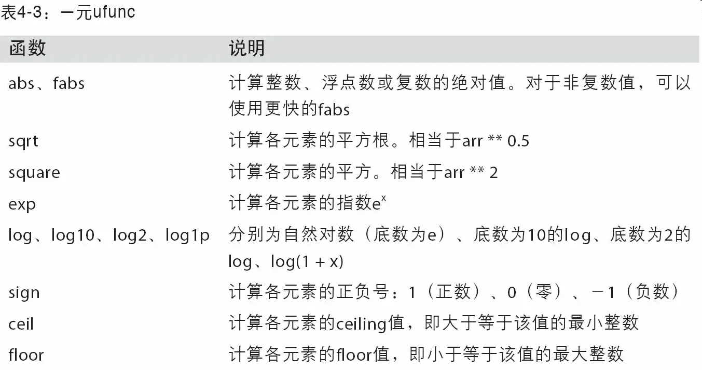
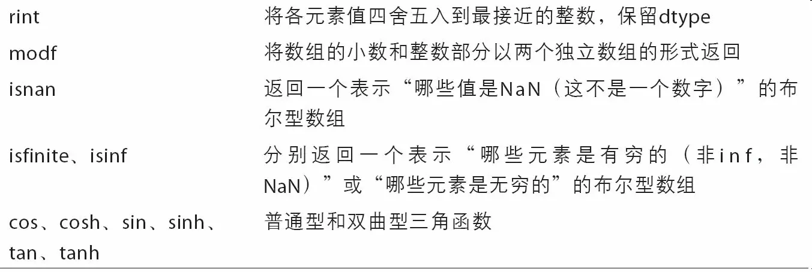
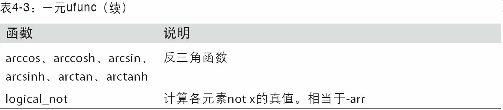
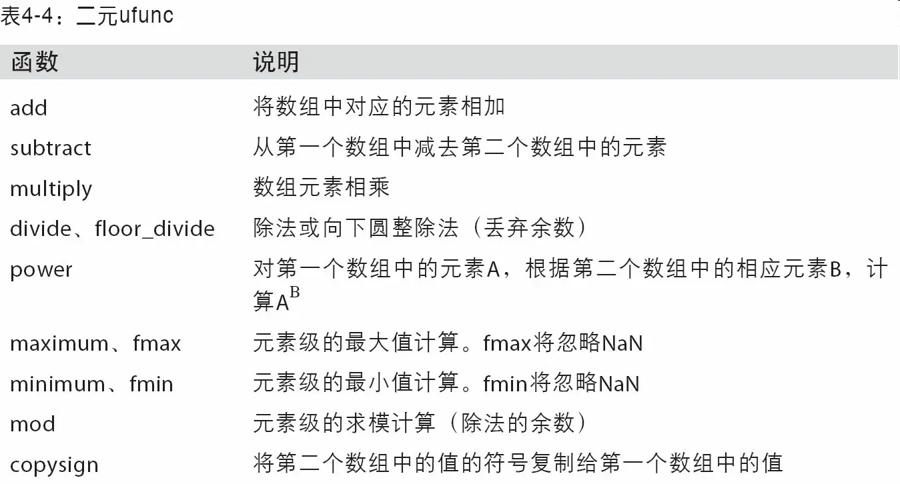
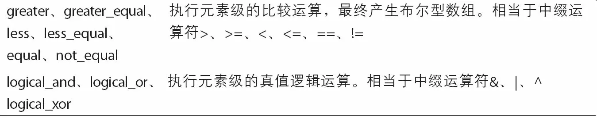


## 利用数组进行数据处理
NumPy数组使你可以将许多种数据处理任务表述为简洁的数组表达式（否则需要编写循环）。用数组表达式代替循环的做法，通常被称为矢量化。一般来说，矢量化数组运算要比等价的纯Python方式快上一两个数量级（甚至更多），尤其是各种数值计算。在后面内容中（见附录A）我将介绍广播，这是一种针对矢量化计算的强大手段。

作为简单的例子，假设我们想要在一组值（网格型）上计算函数`sqrt(x^2+y^2)`。`np.meshgrid`函数接受两个一维数组，并产生两个二维矩阵（对应于两个数组中所有的(x,y)对）：
```py
In [155]: points = np.arange(-5, 5, 0.01) # 1000 equally spaced points

In [156]: xs, ys = np.meshgrid(points, points)
In [157]: ys
Out[157]: 
array([[-5.  , -5.  , -5.  , ..., -5.  , -5.  , -5.  ],
       [-4.99, -4.99, -4.99, ..., -4.99, -4.99, -4.99],
       [-4.98, -4.98, -4.98, ..., -4.98, -4.98, -4.98],
       ..., 
       [ 4.97,  4.97,  4.97, ...,  4.97,  4.97,  4.97],
       [ 4.98,  4.98,  4.98, ...,  4.98,  4.98,  4.98],
       [ 4.99,  4.99,  4.99, ...,  4.99,  4.99,  4.99]])
```
现在，对该函数的求值运算就好办了，把这两个数组当做两个浮点数那样编写表达式即可：
```py
In [158]: z = np.sqrt(xs ** 2 + ys ** 2)

In [159]: z
Out[159]: 
array([[ 7.0711,  7.064 ,  7.0569, ...,  7.0499,  7.0569,  7.064 ],
       [ 7.064 ,  7.0569,  7.0499, ...,  7.0428,  7.0499,  7.0569],
       [ 7.0569,  7.0499,  7.0428, ...,  7.0357,  7.0428, 7.0499],
       ..., 
       [ 7.0499,  7.0428,  7.0357, ...,  7.0286,  7.0357,  7.0428],
       [ 7.0569,  7.0499,  7.0428, ...,  7.0357,  7.0428,  7.0499],
       [ 7.064 ,  7.0569,  7.0499, ...,  7.0428,  7.0499,  7.0569]])
```

### 将条件逻辑表述为数组运算
`numpy.where`函数是三元表达式`x if condition else y`的矢量化版本。假设我们有一个布尔数组和两个值数组：
```py
In [165]: xarr = np.array([1.1, 1.2, 1.3, 1.4, 1.5])

In [166]: yarr = np.array([2.1, 2.2, 2.3, 2.4, 2.5])

In [167]: cond = np.array([True, False, True, True, False])
```
假设我们想要根据`cond`中的值选取`xarr`和`yarr`的值：当`cond`中的值为`True`时，选取`xarr`的值，否则从`yarr`中选取。列表推导式的写法应该如下所示：
```py
In [168]: result = [(x if c else y)
   .....:           for x, y, c in zip(xarr, yarr, cond)]

In [169]: result
Out[169]: [1.1000000000000001, 2.2000000000000002, 1.3, 1.3999999999999999, 2.5]
```
这有几个问题。第一，它对大数组的处理速度不是很快（因为所有工作都是由纯Python完成的）。第二，无法用于多维数组。若使用np.where，则可以将该功能写得非常简洁：
```py
In [170]: result = np.where(cond, xarr, yarr)

In [171]: result
Out[171]: array([ 1.1,  2.2,  1.3,  1.4,  2.5])
```
`np.where`的第二个和第三个参数不必是数组，它们都可以是标量值。在数据分析工作中，`where`通常用于根据另一个数组而产生一个新的数组。假设有一个由随机数据组成的矩阵，你希望将所有正值替换为2，将所有负值替换为－2。若利用np.where，则会非常简单：
```py
In [172]: arr = np.random.randn(4, 4)

In [173]: arr
Out[173]: 
array([[-0.5031, -0.6223, -0.9212, -0.7262],
       [ 0.2229,  0.0513, -1.1577,  0.8167],
       [ 0.4336,  1.0107,  1.8249, -0.9975],
       [ 0.8506, -0.1316,  0.9124,  0.1882]])

In [174]: arr > 0
Out[174]: 
array([[False, False, False, False],
       [ True,  True, False,  True],
       [ True,  True,  True, False],
       [ True, False,  True,  True]], dtype=bool)

In [175]: np.where(arr > 0, 2, -2)
Out[175]: 
array([[-2, -2, -2, -2],
       [ 2,  2, -2,  2],
       [ 2,  2,  2, -2],
       [ 2, -2,  2,  2]])
```
使用`np.where`，可以将标量和数组结合起来。例如，我可用常数2替换arr中所有正的值：
```py
In [176]: np.where(arr > 0, 2, arr) # set only positive values to 2
Out[176]: 
array([[-0.5031, -0.6223, -0.9212, -0.7262],
       [ 2.    ,  2.    , -1.1577,  2.    ],
       [ 2.    ,  2.    ,  2.    , -0.9975],
       [ 2.    , -0.1316,  2.    ,  2.    ]])
```

### 数学和统计方法
可以通过数组上的一组数学函数对整个数组或某个轴向的数据进行统计计算。`sum、mean`以及标准差`std`等聚合计算（`aggregation`，通常叫做约简（`reduction`））既可以当做数组的实例方法调用，也可以当做顶级NumPy函数使用。
- sum：计算数组元素和
- mean：计算数组元素平均值
这里，我生成了一些正态分布随机数据，然后做了聚类统计：
```py
In [177]: arr = np.random.randn(5, 4)

In [178]: arr
Out[178]: 
array([[ 2.1695, -0.1149,  2.0037,  0.0296],
       [ 0.7953,  0.1181, -0.7485,  0.585 ],
       [ 0.1527, -1.5657, -0.5625, -0.0327],
       [-0.929 , -0.4826, -0.0363,  1.0954],
       [ 0.9809, -0.5895,  1.5817, -0.5287]])

In [179]: arr.mean()
Out[179]: 0.19607051119998253

In [180]: np.mean(arr)
Out[180]: 0.19607051119998253

In [181]: arr.sum()
Out[181]: 3.9214102239996507
```

`mean`和`sum`这类的函数可以接受一个`axis`选项参数，用于计算该轴向上的统计值，最终结果是一个少一维的数组：
```py
In [182]: arr.mean(axis=1)
Out[182]: array([ 1.022 ,  0.1875, -0.502 , -0.0881,  0.3611])

In [183]: arr.sum(axis=0)
Out[183]: array([ 3.1693, -2.6345,  2.2381,  1.1486])
```
`arr.mean(1)`是“计算行的平均值”，`arr.sum(0)`是“计算每列的和”。
在多维数组中，累加函数（如cumsum）返回的是同样大小的数组，但是会根据每个低维的切片沿着标记轴计算部分聚类：
```py
In [186]: arr = np.array([[0, 1, 2], [3, 4, 5], [6, 7, 8]])

In [187]: arr
Out[187]: 
array([[0, 1, 2],
       [3, 4, 5],
       [6, 7, 8]])

In [188]: arr.cumsum(axis=0)
Out[188]: 
array([[ 0,  1,  2],
       [ 3,  5,  7],
       [ 9, 12, 15]])

In [189]: arr.cumprod(axis=1)
Out[189]: 
array([[  0,   0,   0],
       [  3,  12,  60],
       [  6,  42, 336]])
```

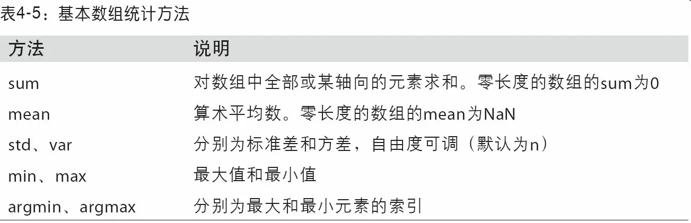
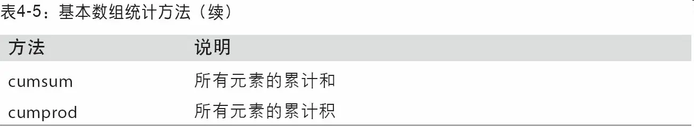

### 用于布尔型数组的方法
- any：是否有 True
- all：是否都为 True

### 排序
跟Python内置的列表类型一样，NumPy数组也可以通过`sort`方法就地排序：
```py
In [195]: arr = np.random.randn(6)

In [196]: arr
Out[196]: array([ 0.6095, -0.4938,  1.24  , -0.1357,  1.43  , -0.8469])

In [197]: arr.sort()

In [198]: arr
Out[198]: array([-0.8469, -0.4938, -0.1357,  0.6095,  1.24  ,  1.43  ])
```
多维数组可以在任何一个轴向上进行排序，只需将轴编号传给sort即可：
```py
In [199]: arr = np.random.randn(5, 3)

In [200]: arr
Out[200]: 
array([[ 0.6033,  1.2636, -0.2555],
       [-0.4457,  0.4684, -0.9616],
       [-1.8245,  0.6254,  1.0229],
       [ 1.1074,  0.0909, -0.3501],
       [ 0.218 , -0.8948, -1.7415]])

In [201]: arr.sort(1)

In [202]: arr
Out[202]: 
array([[-0.2555,  0.6033,  1.2636],
       [-0.9616, -0.4457,  0.4684],
       [-1.8245,  0.6254,  1.0229],
       [-0.3501,  0.0909,  1.1074],
       [-1.7415, -0.8948,  0.218 ]])
```
顶级方法np.sort返回的是数组的已排序副本，而就地排序则会修改数组本身。计算数组分位数最简单的办法是对其进行排序，然后选取特定位置的值：
```py
In [203]: large_arr = np.random.randn(1000)

In [204]: large_arr.sort()

In [205]: large_arr[int(0.05 * len(large_arr))] # 5% quantile
Out[205]: -1.5311513550102103
```

### 唯一化以及其它的集合逻辑
NumPy提供了一些针对一维ndarray的基本集合运算。最常用的可能要数`np.unique`了，它用于找出数组中的唯一值并返回已排序的结果
```py
In [206]: names = np.array(['Bob', 'Joe', 'Will', 'Bob', 'Will', 'Joe', 'Joe'])

In [207]: np.unique(names)
Out[207]: 
array(['Bob', 'Joe', 'Will'],
      dtype='<U4')

In [208]: ints = np.array([3, 3, 3, 2, 2, 1, 1, 4, 4])

In [209]: np.unique(ints)
Out[209]: array([1, 2, 3, 4])
```

另一个函数np.in1d用于测试一个数组中的值在另一个数组中的成员资格，返回一个布尔型数组：
```py
In [211]: values = np.array([6, 0, 0, 3, 2, 5, 6])

In [212]: np.in1d(values, [2, 3, 6])
Out[212]: array([ True, False, False,  True,  True, False,  True], dtype=bool)
```

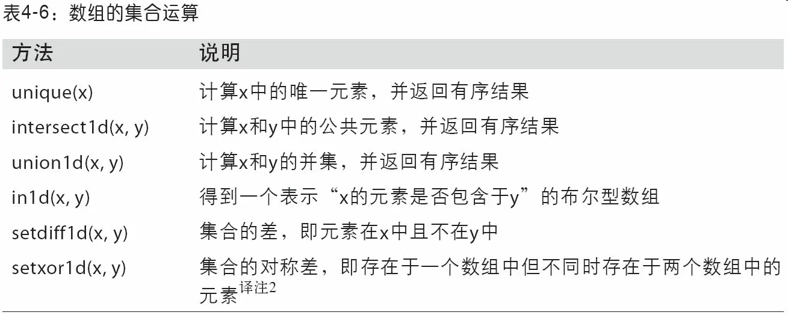

## 用于数组的文件输入输出
NumPy能够读写磁盘上的文本数据或二进制数据。这一小节只讨论NumPy的内置二进制格式，因为更多的用户会使用pandas或其它工具加载文本或表格数据（见第6章）。
`np.save`和`np.load`是读写磁盘数组数据的两个主要函数。默认情况下，数组是以未压缩的原始二进制格式保存在扩展名为.npy的文件中的：
```py
In [213]: arr = np.arange(10)

In [214]: np.save('some_array', arr)
```
如果文件路径末尾没有扩展名.npy，则该扩展名会被自动加上。然后就可以通过np.load读取磁盘上的数组：
```py
In [215]: np.load('some_array.npy')
Out[215]: array([0, 1, 2, 3, 4, 5, 6, 7, 8, 9])
```
通过np.savez可以将多个数组保存到一个未压缩文件中，将数组以关键字参数的形式传入即可：
```py
In [216]: np.savez('array_archive.npz', a=arr, b=arr)
```
加载.npz文件时，你会得到一个类似字典的对象，该对象会对各个数组进行延迟加载：
```py
In [217]: arch = np.load('array_archive.npz')

In [218]: arch['b']
Out[218]: array([0, 1, 2, 3, 4, 5, 6, 7, 8, 9])
```
如果要将数据压缩，可以使用`numpy.savez_compressed`：
```py
In [219]: np.savez_compressed('arrays_compressed.npz', a=arr, b=arr)
```

## 线性代数
线性代数（如矩阵乘法、矩阵分解、行列式以及其他方阵数学等）是任何数组库的重要组成部分。不像某些语言（如MATLAB），通过*对两个二维数组相乘得到的是一个元素级的积，而不是一个矩阵点积。因此，NumPy提供了一个用于矩阵乘法的dot函数（既是一个数组方法也是numpy命名空间中的一个函数）：
```py
In [223]: x = np.array([[1., 2., 3.], [4., 5., 6.]])

In [224]: y = np.array([[6., 23.], [-1, 7], [8, 9]])

In [225]: x
Out[225]: 
array([[ 1.,  2.,  3.],
       [ 4.,  5.,  6.]])

In [226]: y
Out[226]: 
array([[  6.,  23.],
       [ -1.,   7.],
       [  8.,   9.]])

In [227]: x.dot(y)
Out[227]: 
array([[  28.,   64.],
       [  67.,  181.]])
```
`x.dot(y)`等价于`np.dot(x, y)`：
```py
In [228]: np.dot(x, y)
Out[228]: 
array([[  28.,   64.],
       [  67.,  181.]])
```

一个二维数组跟一个大小合适的一维数组的矩阵点积运算之后将会得到一个一维数组：
```py
In [229]: np.dot(x, np.ones(3))
Out[229]: array([  6.,  15.])
```

`@`符（类似Python 3.5）也可以用作中缀运算符，进行矩阵乘法：
```py
In [230]: x @ np.ones(3)
Out[230]: array([  6.,  15.])
```
`numpy.linalg`中有一组标准的矩阵分解运算以及诸如求逆和行列式之类的东西。它们跟MATLAB和R等语言所使用的是相同的行业标准线性代数库，如BLAS、LAPACK、Intel MKL（Math Kernel Library，可能有，取决于你的NumPy版本）等

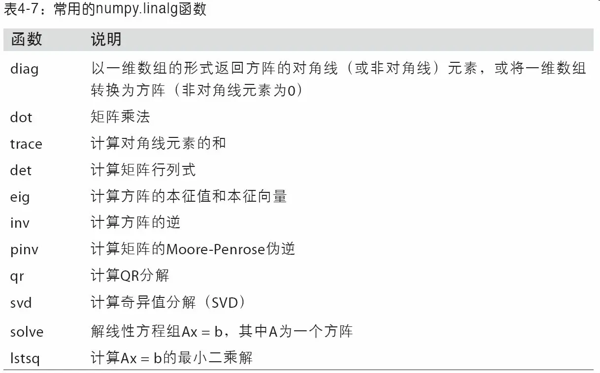


## 伪随机数生成
`numpy.random`模块对Python内置的random进行了补充，增加了一些用于高效生成多种概率分布的样本值的函数。例如，你可以用normal来得到一个标准正态分布的4×4样本数组：
```py
In [238]: samples = np.random.normal(size=(4, 4))

In [239]: samples
Out[239]: 
array([[ 0.5732,  0.1933,  0.4429,  1.2796],
       [ 0.575 ,  0.4339, -0.7658, -1.237 ],
       [-0.5367,  1.8545, -0.92  , -0.1082],
       [ 0.1525,  0.9435, -1.0953, -0.144 ]])
```


## 示例：随机漫步
我们通过模拟随机漫步来说明如何运用数组运算。先来看一个简单的随机漫步的例子：从0开始，步长1和－1出现的概率相等。
下面是一个通过内置的random模块以纯Python的方式实现1000步的随机漫步：
```py
In [247]: import random
   .....: position = 0
   .....: walk = [position]
   .....: steps = 1000
   .....: for i in range(steps):
   .....:     step = 1 if random.randint(0, 1) else -1
   .....:     position += step
   .....:     walk.append(position)
   .....:
```
查看生成结果：
```py
In [249]: plt.plot(walk[:100])
```

用np.random模块一次性随机产生1000个“掷硬币”结果（即两个数中任选一个），将其分别设置为1或－1，然后计算累计和：
```py
In [251]: nsteps = 1000

In [252]: draws = np.random.randint(0, 2, size=nsteps)

In [253]: steps = np.where(draws > 0, 1, -1)

In [254]: walk = steps.cumsum()
```
有了这些数据之后，我们就可以沿着漫步路径做一些统计工作了，比如求取最大值和最小值：
```py
In [255]: walk.min()
Out[255]: -3

In [256]: walk.max()
Out[256]: 31
```
现在来看一个复杂点的统计任务——首次穿越时间，即随机漫步过程中第一次到达某个特定值的时间。假设我们想要知道本次随机漫步需要多久才能距离初始0点至少10步远（任一方向均可）。np.abs(walk)>=10可以得到一个布尔型数组，它表示的是距离是否达到或超过10，而我们想要知道的是第一个10或－10的索引。可以用argmax来解决这个问题，它返回的是该布尔型数组第一个最大值的索引（True就是最大值）：
```py
In [257]: (np.abs(walk) >= 10).argmax()
Out[257]: 37
```

### 一次模拟多个随机漫步
如果你希望模拟多个随机漫步过程（比如5000个），只需对上面的代码做一点点修改即可生成所有的随机漫步过程。只要给numpy.random的函数传入一个二元元组就可以产生一个二维数组，然后我们就可以一次性计算5000个随机漫步过程（一行一个）的累计和了：
```py
In [258]: nwalks = 5000

In [259]: nsteps = 1000

In [260]: draws = np.random.randint(0, 2, size=(nwalks, nsteps)) # 0 or 1

In [261]: steps = np.where(draws > 0, 1, -1)

In [262]: walks = steps.cumsum(1)

In [263]: walks
Out[263]: 
array([[  1,   0,   1, ...,   8,   7,   8],
       [  1,   0,  -1, ...,  34,  33,  32],
       [  1,   0,  -1, ...,   4,   5,   4],
       ..., 
       [  1,   2,   1, ...,  24,  25,  26],
       [  1,   2,   3, ...,  14,  13,  14],
       [ -1,  -2,  -3, ..., -24, -23, -22]])
```
现在，我们来计算所有随机漫步过程的最大值和最小值：
```py
In [264]: walks.max()
Out[264]: 138

In [265]: walks.min()
Out[265]: -133
```
得到这些数据之后，我们来计算30或－30的最小穿越时间。这里稍微复杂些，因为不是5000个过程都到达了30。我们可以用any方法来对此进行检查：
```py
In [266]: hits30 = (np.abs(walks) >= 30).any(1)

In [267]: hits30
Out[267]: array([False,  True, False, ..., False,  True, False], dtype=bool)

In [268]: hits30.sum() # Number that hit 30 or -30
Out[268]: 3410
```
然后我们利用这个布尔型数组选出那些穿越了30（绝对值）的随机漫步（行），并调用argmax在轴1上获取穿越时间：
```py
In [269]: crossing_times = (np.abs(walks[hits30]) >= 30).argmax(1)

In [270]: crossing_times.mean()
Out[270]: 498.88973607038122
```