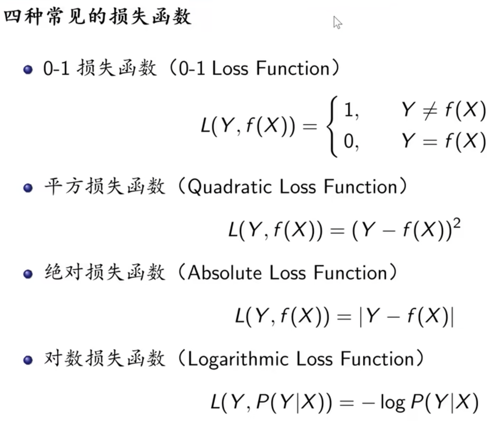
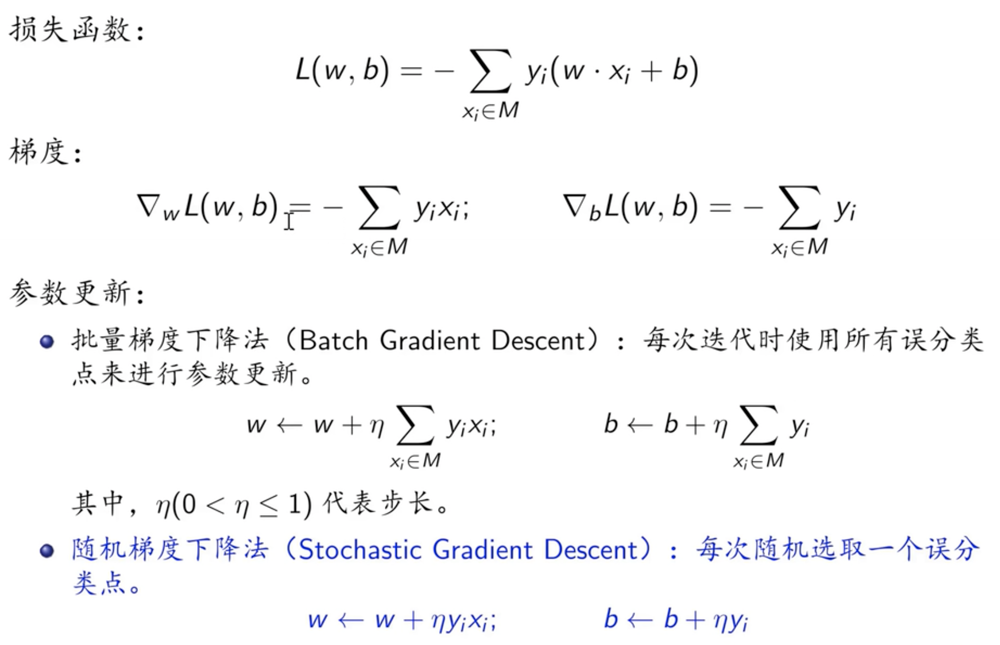
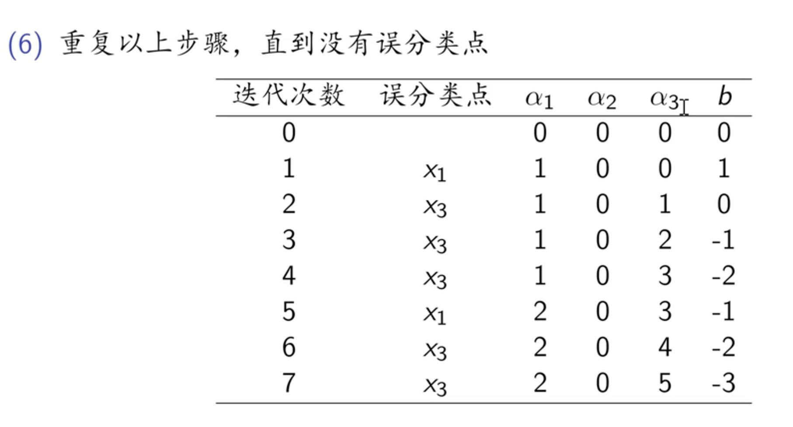
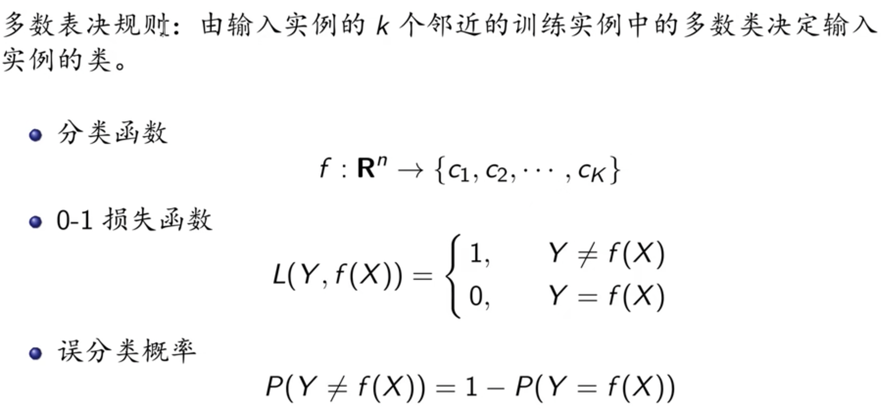
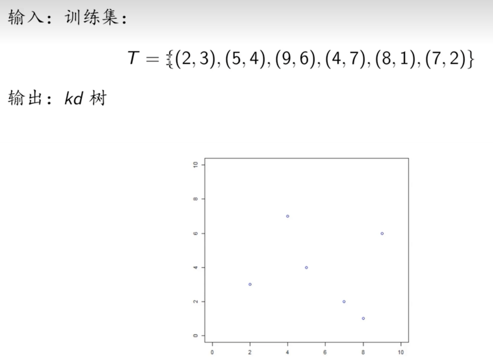

# 统计学习方法

## 概述
### 定义与分类

特点
- 以计算机和网络为平台
- 以数据为研究对象
- 以预测和分析数据为目的
- 以方法为中心
- 是多领域交叉的学科

定义：关于计算机基于数据构件概率统计模型，并运用模型对数据进行预测与分析的一门学科

### 统计学习的方法
三要素：
- 模型
- 策略
- 算法

### 分类

#### 监督学习
是指从标注数据中学习预测模型的机器学习问题，其本质是学习输入到输出的映射的统计规律

- 输入空间：输入的所有可能取值的集合
- 实例：每一个具体的输入，通常由特征向量表示
- 特征空间：所有特征向量存在的空间
- 输出空间：所有可能的输出值集合

##### 模型

##### 策略

- 0-1损失函数：分类问题
- 平方-绝对：回归问题
- 对数：概率模型

##### 算法

#### 无监督学习

#### 强化学习

### 模型评估与模型选择

#### 过拟合与模型选择
当假设空间含有不同复杂度（例如，不同的参数个数）的模型时，就要面临模型选择（model selection）的问题。如果在假设空间中存在“真”模型，那么所选择的模型应该逼近真模型。具体地，所选择的模型要与真模型的参数个数相同，所选择的模型的参数向量与真模型的参数向量相近。
如果一味追求提高对训练数据的预测能力，所选模型的复杂度则往往会比真模型更高。这种现象称为过拟合（over- fitting）。过拟合是指学习时选择的模型所包含的参数过多，以至出现这一模型对已知数据预测得很好，但对未知数据预测得很差的现象。可以说模型选择旨在避免过拟合并提高模型的预测能力。

图1.8给出了M=0，M=1，M=3及M=9时多项式函数拟合的情况。如果M=0，多项式曲线是一个常数，数据拟合效果很差。如果M=1，多项式曲线是一条直线，数据拟合效果也很差。相反，如果M=9，多项式曲线通过每个数据点，训练误差为0。从对给定训练数据拟合的角度来说，效果是最好的。但是，因为训练数据本身存在噪声，这种拟合曲线对未知数据的预测能力往往并不是最好的，在实际学习中并不可取。这时过拟合现象就会发生。这就是说，模型选择时，不仅要考虑对已知数据的预测能力，而且还要考虑对未知数据的预测能力。当M=3时，多项式曲线对训练数据拟合效果足够好，模型也比较简单，是一个较好的选择。

### 正则化与交叉验证
模型选择的典型方法是正则化（regularization）。正则化是结构风险最小化策略的实现，是在经验风险上加一个正则化项（regularizer）或罚项（penalty term）。正则化项一般是模型复杂度的单调递增函数，模型越复杂，正则化值就越大。比如，正则化项可以是模型参数向量的范数。

> 范数（Norm）是一个数学概念，用来衡量向量的大小。在机器学习中，范数经常用于正则化（Regularization）和优化算法中，以控制模型的复杂度和优化目标。
>  范数将向量映射到非负实数集合上，其定义为：
>  $$
  ||\boldsymbol{x}||_p = \left( \sum_{i=1}^n |x_i|^p \right)^{\frac{1}{p}}
  $$
  其中，$\boldsymbol{x}=[x_1, x_2, ..., x_n]^T$ 是一个 $n$ 维向量，$p$ 是范数的阶数。常见的范数有 L1 范数、L2 范数、无穷范数等。
  L1 范数是指向量中各个元素绝对值之和，即 $||\boldsymbol{x}||_1 = \sum_{i=1}^n |x_i|$。L1 范数的作用是使向量中的一些元素变为 0，从而得到一个稀疏向量，常用于特征选择。
  L2 范数是指向量中各个元素的平方和的平方根，即 $||\boldsymbol{x}||_2 = \sqrt{\sum_{i=1}^n x_i^2}$。L2 范数的作用是惩罚向量中每个元素的大小，从而控制模型的复杂度，常用于正则化。
  无穷范数是指向量中各个元素绝对值的最大值，即 $||\boldsymbol{x}||_{\infty} = \max_{i=1,2,...,n} |x_i|$。无穷范数的作用是找出向量中绝对值最大的元素，常用于异常检测和模型鲁棒性分析。
  范数在机器学习中的应用非常广泛，可以用于正则化、优化算法、特征选择和数据预处理等方面。

> 为什么添加范数正则化项能控制模型复杂度
> 在机器学习中，加上范数项可以通过正则化（Regularization）来优化模型，其原因在于范数项可以控制模型的复杂度，从而避免过拟合（Overfitting）。
在机器学习中，我们通常会使用损失函数来衡量模型的预测结果与真实标签之间的差距，并使用优化算法（如梯度下降）来最小化损失函数，从而得到最优的模型参数。然而，有时候模型会过拟合，即在训练数据上表现良好，但在测试数据上表现较差。过拟合的原因通常是因为模型过于复杂，导致在训练数据上出现了过多的细节和噪声。
为了解决过拟合问题，我们可以使用正则化方法。正则化通过在损失函数中添加正则化项来限制模型的复杂度，从而避免模型过拟合。常用的正则化方法包括 L1 正则化、L2 正则化等。这些正则化方法中的范数项起到了控制模型参数大小的作用，在一定程度上减少了模型的自由度，避免了模型过于复杂，从而防止过拟合。
以 L2 正则化为例，其正则化项为 $\frac{\lambda}{2} ||\boldsymbol{w}||_2^2$，其中 $\boldsymbol{w}$ 是模型的权重参数，$\lambda$ 是正则化强度超参数，用于控制正则化项对损失函数的影响。L2 正则化的作用是对模型权重进行惩罚，使得模型权重更加平滑，避免过多的复杂度，从而降低过拟合的风险，提高模型的泛化性能。
因此，通过在损失函数中添加范数项，我们可以控制模型的复杂度，避免过拟合，从而提高模型的泛化性能。

> 为了说明添加正则化项对模型的影响程度，我将举一个简单的线性回归模型的例子。
假设我们有一个简单的线性回归模型，其形式为 $y = \boldsymbol{w}^T\boldsymbol{x} + b$，其中 $\boldsymbol{x}$ 是输入特征，$\boldsymbol{w}$ 是权重参数，$b$ 是偏置项，$y$ 是预测输出。我们使用均方误差（Mean Squared Error，MSE）作为损失函数，其形式为：
$$
L(\boldsymbol{w},b) = \frac{1}{n} \sum_{i=1}^n (y_i - \boldsymbol{w}^T\boldsymbol{x}_i - b)^2
$$
其中，$n$ 是训练样本的数量。
不添加正则化项时，我们使用梯度下降算法对模型参数进行学习，即：
$$
\boldsymbol{w} \leftarrow \boldsymbol{w} - \alpha \frac{\partial L(\boldsymbol{w},b)}{\partial \boldsymbol{w}}
$$
$$
b \leftarrow b - \alpha \frac{\partial L(\boldsymbol{w},b)}{\partial b}
$$
其中，$\alpha$ 是学习率，用于控制参数更新的步长。
现在，我们添加 L2 正则化项到损失函数中，形式为：
$$
L(\boldsymbol{w},b) = \frac{1}{n} \sum_{i=1}^n (y_i - \boldsymbol{w}^T\boldsymbol{x}_i - b)^2 + \frac{\lambda}{2} ||\boldsymbol{w}||_2^2
$$
其中，$\lambda$ 是正则化强度超参数，用于控制正则化项对损失函数的影响。
接着，我们使用梯度下降算法对模型参数进行学习，即：
$$
\boldsymbol{w} \leftarrow \boldsymbol{w} - \alpha \left( \frac{\partial L(\boldsymbol{w},b)}{\partial \boldsymbol{w}} + \lambda \boldsymbol{w} \right)
$$
$$
b \leftarrow b - \alpha \frac{\partial L(\boldsymbol{w},b)}{\partial b}
$$
可以看到，添加正则化项后，更新权重参数的公式中多了一项 $\lambda \boldsymbol{w}$，即正则化项的导数。这个正则化项的导数会对权重参数的更新产生影响，使得权重参数的值变得更小，从而控制模型的复杂度。
通过控制正则化强度 $\lambda$ 的大小，我们可以控制正则化项对损失函数的影响程度。当 $\lambda$ 较小时，正则化项的影响较小，模型的自由度较大，可能会导致过拟合；当 $\lambda$ 较大时，正则化项的影响较大，模型的自由度较小，可能会导致欠拟合。因此，我们需要根据实际情况选择合适的正则化强度，以达到最优的模型性能。

正则化符合奥卡姆剃刀（Occam’s razor）原理。奥卡姆剃刀原理应用于模型选择时变为以下想法：在所有可能选择的模型中，能够很好地解释已知数据并且十分简单才是最好的模型，也就是应该选择的模型。从贝叶斯估计的角度来看，正则化项对应于模型的先验概率。可以假设复杂的模型有较小的先验概率，简单的模型有较大的先验概率。

另一种常用的模型选择方法是交叉验证（cross validation）。如果给定的样本数据充足，进行模型选择的一种简单方法是随机地将数据集切分成三部分，分别为训练集（training set）、验证集（validation set）和测试集（test set）。训练集用来训练模型，验证集用于模型的选择，而测试集用于最终对学习方法的评估。在学习到的不同复杂度的模型中，选择对验证集有最小预测误差的模型。由于验证集有足够多的数据，用它对模型进行选择也是有效的。但是，在许多实际应用中数据是不充足的。为了选择好的模型，可以采用交叉验证方法。交叉验证的基本想法是重复地使用数据；把给定的数据进行切分，将切分的数据集组合为训练集与测试集，在此基础上反复地进行训练、测试以及模型选择。

- 简单交叉验证
  - 首先随机地将已给数据分为两部分，一部分作为训练集，另一部分作为测试集（例如，70%的数据为训练集，30%的数据为测试集）；然后用训练集在各种条件下（例如，不同的参数个数）训练模型，从而得到不同的模型；在测试集上评价各个模型的测试误差，选出测试误差最小的模型。
- S折交叉验证
  - 应用最多的是S折交叉验证（S-fold cross validation），方法如下：首先随机地将已给数据切分为S个互不相交、大小相同的子集；然后利用S−1个子集的数据训练模型，利用余下的子集测试模型；将这一过程对可能的S种选择重复进行；最后选出S次评测中平均测试误差最小的模型。
  
- 留一交叉验证
  - S折交叉验证的特殊情形是S=N，称为留一交叉验证（leave-one-out cross validation），往往在数据缺乏的情况下使用。这里，N是给定数据集的容量。

### 泛化能力
泛化误差

泛化误差上界

Hoeffding不等式

> Hoeffding不等式是一个概率不等式，用于估计独立同分布随机变量的和的概率分布。它的形式如下：
$$
P(|\bar{X}-\mathbb{E}[\bar{X}]| \geq \epsilon) \leq 2e^{-2n\epsilon^2}
$$
其中，$\bar{X}$ 是 $n$ 个独立同分布随机变量 $X_1, X_2, ..., X_n$ 的平均值，$\mathbb{E}[\bar{X}]$ 是 $\bar{X}$ 的期望，$\epsilon$ 是一个正实数，表示 $\bar{X}$ 与其期望之间的偏差。
以下是 Hoeffding 不等式的简单推导：
假设 $X_i$ 服从 $[a,b]$ 上的均匀分布，即 $\mathbb{P}(X_i=x)=\frac{1}{b-a}$，其中 $x \in [a,b]$。我们可以将 $X_i$ 转换成 $[0,1]$ 上的随机变量 $Z_i = \frac{X_i-a}{b-a}$，此时 $Z_i$ 服从 $[0,1]$ 上的均匀分布。
由于 $X_i$ 独立同分布，因此 $Z_i$ 也独立同分布。对于 $\bar{Z}=\frac{1}{n}\sum_{i=1}^n Z_i$，根据大数定律，我们有：
$$
\lim_{n \rightarrow \infty} P(|\bar{Z}-\mathbb{E}[\bar{Z}]| \geq \epsilon) = 0
$$
根据 Markov 不等式，我们有：
$$
P(|\bar{Z}-\mathbb{E}[\bar{Z}]| \geq \epsilon) \leq \frac{\mathrm{Var}[\bar{Z}]}{\epsilon^2}
$$
因此，我们需要估计 $\mathrm{Var}[\bar{Z}]$。由于 $Z_i$ 是 $[0,1]$ 上的均匀分布，因此 $\mathrm{Var}[Z_i] = \frac{1}{12}$。对于 $\bar{Z}$，我们有：
$$
\mathrm{Var}[\bar{Z}] = \mathrm{Var}[\frac{1}{n}\sum_{i=1}^n Z_i] = \frac{1}{n^2} \sum_{i=1}^n \mathrm{Var}[Z_i] = \frac{1}{12n}
$$
将 $\mathrm{Var}[\bar{Z}]$ 代入 Markov 不等式中，我们得到：
$$
P(|\bar{Z}-\mathbb{E}[\bar{Z}]| \geq \epsilon) \leq \frac{1}{\frac{\epsilon^2}{\mathrm{Var}[\bar{Z}]}} = \frac{\mathrm{Var}[\bar{Z}]}{\epsilon^2 } = \frac{1}{12n\epsilon^2}
$$
将 $Z_i$ 转换回 $X_i$，我们得到：
$$
P(|\bar{X}-\mathbb{E}[\bar{X}]| \geq \epsilon(b-a)) \leq \frac{1}{12n\epsilon^2}
$$
将 $12$ 替换为 $2$，我们得到 Hoeffding 不等式：
$$
P(|\bar{X}-\mathbb{E}[\bar{X}]| \geq \epsilon(b-a)) \leq 2e^{-2n\epsilon^2}
$$
因此，Hoeffding 不等式成立。

> $\mathrm{Var}[\bar{Z}]$ 表示随机变量 $\bar{Z}$ 的方差，$\mathrm{Var}[Z_i]$ 表示随机变量 $Z_i$ 的方差。在这里，$Z_i$ 是 $[0,1]$ 上的均匀分布，$\bar{Z}=\frac{1}{n}\sum_{i=1}^n Z_i$ 表示 $n$ 个独立同分布的 $Z_i$ 的平均值。
根据方差的性质，我们有：
$$
\mathrm{Var}[\bar{Z}] = \mathrm{Var}[\frac{1}{n}\sum_{i=1}^n Z_i] = \frac{1}{n^2} \sum_{i=1}^n \mathrm{Var}[Z_i]
$$
因为 $Z_i$ 是 $[0,1]$ 上的均匀分布，所以其方差为：
$$
\mathrm{Var}[Z_i] = \frac{(1-0)^2}{12} = \frac{1}{12}
$$
将 $\mathrm{Var}[Z_i]$ 代入上式，我们得到：
$$
\mathrm{Var}[\bar{Z}] = \mathrm{Var}[\frac{1}{n}\sum_{i=1}^n Z_i] = \frac{1}{n^2} \sum_{i=1}^n \mathrm{Var}[Z_i] = \frac{1}{12n}
$$
因此，$\mathrm{Var}[\bar{Z}]$ 等于 $\frac{1}{12n}$。

### 生成模型与判别模型

生成方法的特点：生成方法可以还原出联合概率分布P（X,Y），而判别方法则不能；生成方法的学习收敛速度更快，即当样本容量增加的时候，学到的模型可以更快地收敛于真实模型；当存在隐变量时，仍可以用生成方法学习，此时判别方法就不能用。
判别方法的特点：判别方法直接学习的是条件概率P（Y|X）或决策函数f（X），直接面对预测，往往学习的准确率更高；由于直接学习P（Y|X）或f（X），可以对数据进行各种程度上的抽象、定义特征并使用特征，因此可以简化学习问题。

生成模型和判别模型的差异在于它们建模的目标不同。生成模型学习的是数据的整体分布，可以用于生成新的数据样本，但不能直接用于分类等任务。判别模型学习的是输入变量与输出变量之间的映射关系，可以直接用于分类、回归等任务，但不能生成新的数据样本。因此，在选择模型时需要根据具体的任务需求来决定使用哪种类型的模型。

需要注意的是，生成模型和判别模型并不是绝对的对立关系。有些模型既可以看作是生成模型，又可以看作是判别模型，例如深度信念网络和变分自编码器等。另外，在一些特定的任务中，生成模型和判别模型也可以组合使用，例如生成对抗网络（GAN）就是将生成模型和判别模型结合起来的模型。

### 监督学习的应用
监督学习的应用主要在三个方面：分类问题、标注问题和回归问题。
- 分类问题
  - 在监督学习中，当输出变量Y取有限个离散值时，预测问题便成为分类问题。这时，输入变量X可以是离散的，也可以是连续的。
- 标注问题
  - 可以认为标注问题是分类问题的一个推广，标注问题又是更复杂的结构预测（structure prediction）问题的简单形式。标注问题的输入是一个观测序列，输出是一个标记序列或状态序列。标注问题的目标在于学习一个模型，使它能够对观测序列给出标记序列作为预测。
- 回归问题
  - 回归用于预测输入变量（自变量）和输出变量（因变量）之间的关系，特别是当输入变量的值发生变化时，输出变量的值随之发生的变化。回归模型正是表示从输入变量到输出变量之间映射的函数。回归问题的学习等价于函数拟合：选择一条函数曲线使其很好地拟合已知数据且很好地预测未知数据

## 感知机
感知机（perceptron）是二类分类的线性分类模型，其输入为实例的特征向量，输出为实例的类别，取+1和−1二值。感知机对应于输入空间（特征空间）中将实例划分为正负两类的分离超平面，属于判别模型。感知机学习旨在求出将训练数据进行线性划分的分离超平面，为此，导入基于误分类的损失函数，利用梯度下降法对损失函数进行极小化，求得感知机模型。

上例中，特征向量是二维的，分离超平面是$wx+b=0$，垂直于超平面的是法向量$w$，$x-\frac{b}{\left|w\right|}$代表原点与超平面的距离，圆点与叉点是输出空间值，

- 超平面：比所在环境的维度空间小一维的子空间

### 学习策略

假设训练数据集是线性可分的，感知机学习的目标是求得一个能够将训练集正实例点和负实例点完全正确分开的分离超平面。为了找出这样的超平面，即确定感知机模型参数w，b，需要确定一个学习策略，即定义（经验）损失函数并将损失函数极小化。
损失函数的一个自然选择是误分类点的总数。但是，这样的损失函数不是参数w，b的连续可导函数，不易优化。损失函数的另一个选择是误分类点到超平面S的总距离，这是感知机所采用的。

> 假设平面上的一点为 $(x_0, y_0)$，分离超平面的解析式为 $w^\top x + b = 0$，其中 $w$ 是一个法向量，$b$ 是一个偏置项。则该点到分离超平面的距离为：
$$
d = \frac{|w^\top x_0 + b|}{\|w\|}
$$
其中，$w^\top x_0 + b$ 表示点 $(x_0, y_0)$ 到超平面的带符号距离，$\|w\|$ 表示 $w$ 的长度，即法向量的模长。如果点 $(x_0, y_0)$ 在分离超平面的正面，即 $w^\top x_0 + b > 0$，则距离为正；如果点 $(x_0, y_0)$ 在分离超平面的负面，即 $w^\top x_0 + b < 0$，则距离为负；如果点 $(x_0, y_0)$ 恰好在分离超平面上，即 $w^\top x_0 + b = 0$，则距离为 $0$。
上述公式的推导可以通过点到超平面的投影来得到。具体地，点 $(x_0, y_0)$ 到分离超平面的垂线的方向向量为 $w$，因此点 $(x_0, y_0)$ 在超平面上的投影为 $x_p = x_0 - \frac{w^\top x_0 + b}{\|w\|^2}w$。则点到超平面的距离为点 $(x_0, y_0)$ 到其在超平面上的投影 $x_p$ 的距离，即
$$
d = \|x_0 - x_p\| = \frac{|w^\top x_0 + b|}{\|w\|}
$$
其中，$\|x_0 - x_p\|$ 表示点 $(x_0, y_0)$ 到其在超平面上的投影 $x_p$ 的欧几里得距离，即点到直线的距离。

#### 梯度下降法
感知机学习问题转化为求解损失函数式的最优化问题，最优化的方法是随机梯度下降法。
当损失函数对于模型参数的偏导是凸函数时，可以用梯度下降法求解最优值

##### 原理

#### 原始形式的的学习算法
##### 学习问题

##### 原始形式：随机梯度下降法

##### 例题

#### 对偶形式的的学习算法

##### 对偶形式

##### 例题

#### 算法收敛性

## k近邻
k近邻法（k-nearest neighbor，k-NN）是一种基本分类与回归方法。
k近邻法假设给定一个训练数据集，其中的实例类别已定。分类时，对新的实例，根据其k个最近邻的训练实例的类别，通过多数表决等方式进行预测。

### 算法

### 三要素
- 距离度量
  
  
- k 值的选择
  
- 分类决策规则
  

### 构造kd树

  
#### 搜索kd树
最近邻搜素

## 朴素贝叶斯法
### 贝叶斯定理

>已知有AB两个盒子，A中有7个巧克力，其中3个是黑色的，B盒中有9个巧克力，1个是黑色的。
（1）取出一块巧克力，已知他来自A盒，求是黑色的概率
（2）取出一块巧克力，已知他是黑色，求他来自A盒的概率
解：（1）$P(Black|BoxA) = \frac{P(Black\space and\space BoxA)}{P(BoxA)}=\frac{\frac{3}{7}}{\frac{7}{16}}=\frac{3}{7}$
(2) $P(BoxA|Black) = \frac{P(BoxA \space and \space Black)}{P(Black)} = \frac{P(Black|BoxA) \cdot P(BoxA)}{P(Black|BoxA)\cdot P(BoxA) + P(Black|BoxB)\cdot p(BoxB)} = \frac{\frac{3}{7}\cdot \frac{7}{16}}{\frac{3}{7}\cdot \frac{7}{16} + \frac{1}{9}\cdot \frac{9}{16}} = \frac{3}{4}$

> 贝叶斯定理可以从全概率公式和条件概率公式推导得出。假设有两个事件A和B，根据全概率公式，我们可以得到：
P(A) = P(A|B)P(B) + P(A|~B)P(~B)
其中，~B表示B的补集，P(A|B)表示在事件B发生的条件下事件A发生的概率，P(B)和P(~B)分别表示事件B和~B发生的概率。
然后，根据条件概率公式，我们可以将P(A|B)和P(A|~B)表示为：
P(A|B) = P(B|A)P(A) / P(B)
P(A|~B) = P(~B|A)P(A) / P(~B)
将上面两个式子代入全概率公式中，可以得到：
P(A) = P(B|A)P(A) / P(B) * P(B) + P(~B|A)P(A) / P(~B) * P(~B)
化简后可得：
P(A|B) = P(B|A)P(A) / [P(B|A)P(A) + P(B|~A)P(\~A)]
这就是贝叶斯定理的公式形式。

在刚才巧克力的场景下，可以求出一块黑巧克力来自A还是B的概率哪个更大，这样就是一个分类问题，即贝叶斯分类。

### 什么是朴素
当x有多个特征时，假设实例点中的每个特征相互独立

### 基本方法

为什么要做条件独立性假设？
> 条件独立性假设的意义在于，它使得朴素贝叶斯分类器可以将每个特征的概率单独计算，并将它们的概率乘起来得到整个样本的概率。这个计算过程非常高效，因为它避免了需要计算联合概率分布的复杂度。
具体地说，假设有一个待分类的样本x，它包含n个特征（或维度）x1, x2, ..., xn。朴素贝叶斯分类器的目标是计算每个可能的类别y的后验概率P(y|x)。根据贝叶斯定理，可以将后验概率计算公式表示为：
P(y|x) = P(x|y)P(y) / P(x)
其中，P(x|y)表示在给定类别y的情况下，样本x的特征概率，P(y)表示类别y的先验概率，P(x)表示样本x的概率。
由于条件独立性假设，可以将P(x|y)表示为各个特征的概率乘积：
P(x|y) = P(x1|y)P(x2|y)...P(xn|y)
这样，就可以将朴素贝叶斯分类器的计算过程简化为对每个特征的概率进行单独的计算，从而大大提高了分类器的效率。

#### 后验概率最大化

### 极大似然估计

#### 原理
概率最大化

#### 实现
安检累  设备类